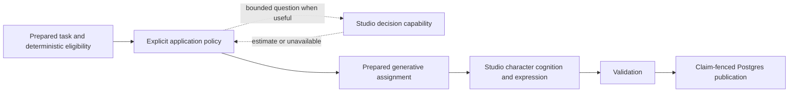

# Learned judgment in Studio: Laya exploration

Date: 2026-09-19. Status: deferred until the harness is built and legacy plumbing is removed; no model installed, inference run, production hook, schema migration, or learned routing enabled. Source baseline: backend `9dac93e`; modernization checkpoint: wiki `bf2c3d2`. Published performance below is the author's evidence, not a Scoracle measurement.

**Recommendation:** recognize learned judgment as an optional, typed Studio capability. Evaluate Laya as one implementation. Keep explicit Rust policy in charge of actions. After all nine seats are in Studio and the old junction/runtime plumbing is removed, begin with the proposed Editor shadow experiment. Do not implement or run this exploration alongside the harness build.

This preserves the three systems: Postgres holds source-bearing facts and durable work; DuckDB studies stored evidence and can analyze experiment results; Studio provides cognition, including bounded learned judgments when useful. A model's prediction is an observation with provenance, not a new world fact.

## 1. What the Laya evidence supports

The model card identifies Apache-2.0 weights, a 421M English ModernBERT-based checkpoint with a 512-token question/options/state budget, and separate multilingual and workflow-specialized checkpoints. The reported 32.8 ms figure belongs to the multilingual checkpoint on a T4; the English model is reported at 39.5 ms. Neither is a measured CPU-sidecar result for Scoracle. [Model card](https://huggingface.co/convaiinnovations/laya)

The published typed-decision test reports approximately 0.36 accuracy for the base model versus 0.766 after workflow-specific training; its majority baseline is 0.461. This supports specialization as a hypothesis, not sports readiness. The benchmark report also acknowledges shipped overconfidence, confident language failures, and only 0.625–0.657 accuracy on its passage-relevance task. A proper scoring objective does not guarantee deployment calibration. These are author-reported results on other distributions, not evidence of safe Scoracle rejection. [Benchmark report](https://github.com/NandhaKishorM/laya/blob/main/BENCHMARKS.md)

Implementation details matter. The SDK constructs a sequence for each question and batches them; adding questions is not free. It returns a distribution, a separate learned action score, and a `confidence` field. For choice/score, that confidence is normalized inverse entropy, not measured probability of correctness. For boolean questions, the SDK uses the larger class probability. State text is truncated after the question and option budget. Scoracle must inspect the actual tokens seen and retain probability distributions rather than branch on the generic confidence field. [Sequence and confidence code](https://github.com/NandhaKishorM/laya/blob/main/laya/common.py), [Inference code](https://github.com/NandhaKishorM/laya/blob/main/laya/agent.py)

The SDK supports CPU and MPS, but defaults to available acceleration and can fall back to CPU. For an experiment intended to keep Granite's accelerator free, select CPU explicitly and record the actual device. Pin a downloaded checkpoint revision, tokenizer, SDK, and dependencies in a local model directory: the inspected loader does not expose a revision argument, and its response's generic model name is insufficient provenance. [Loader implementation](https://github.com/NandhaKishorM/laya/blob/main/laya/agent.py)

Start with one fixed checkpoint. The SDK router's default resident-model limit is one; alternating checkpoints can trigger reloads. Its automatic workflow detection is also unrelated to Scoracle's character policy. Do not import that router into the harness control model. [Router implementation](https://github.com/NandhaKishorM/laya/blob/main/laya/router.py)

These sources are moving quickly. Pin the versions used by an actual experiment; this review inspected the public sources available on the date above. No weights or upstream code were executed.

## 2. Responsibility map grounded in the current code

| Responsibility | Owner and proposed treatment |
|---|---|
| IDs, exact name resolution, source references, clocks, missingness, deduplication hashes, numeric ratings, budgets | Deterministic code. Keep Postgres normalization and exact-name matching in `application/editor/resolve.rs`; retain Studio's pure grouping and derivations. A classifier cannot authorize an identity merge. |
| Claim tokens, desired/running revisions, retry/defer policy, publication, outbox, completion | Deterministic application/runtime code. Learned scores have no write or queue authority. |
| Core context eligibility | Deterministic mission rules: required identity/measurement material, temporal compatibility, source provenance, availability constraints and character boundaries remain hard requirements. “Opt in” means no gratuitous context, not removal of necessary foundations. |
| Article page shape, semantic relevance, injury/transfer/emotional signals | Good learned-judgment candidates, subject to task-specific evidence. Editor currently asks for descriptions and derives relevance/routing in code; replacing an individual label alone does not eliminate its multi-output model call. |
| Semantic novelty or story continuation | Later candidate. Requires a bounded, time-correct comparison set and distinct labels for duplicates, corroboration, contradiction, correction, and continuation. Similarity alone cannot discard a new source. Keep exact hashes and existing story matching as the baseline. |
| Optional context and memory relevance | Promising candidate: rank whole optional `EvidenceGroup`s. Preserve qualifications, contradictions, provenance, and `required` groups. Previous generated prose remains separately budgeted; it must not evict facts or become its own corroboration. |
| Provider selection before retrieval | Later candidate using cheap availability/freshness summaries. Only this earlier position can avoid provider reads. Fetching every candidate before asking the model saves no retrieval cost. |
| Whether a character runs | Highest-risk later gate, after deterministic invalidation/debounce. Must distinguish no useful change from unknown, provider failure, a required closing read, or a pending obligation. Never suppress authoritative measurement refresh or durable reconciliation. |
| Scouting interpretation, Vibe, transfer reasoning, Momentum, narratives, Oracle synthesis | Generative Studio assignments. Preserve Granite 4.2 3B as the user-specified incumbent; this review has not inspected deployed route overrides. |
| Expression of a character's interpretation | Character instructions and validated output contract within the generative assignment. No mandatory second “articulation model” or fourth serial service. |

Concrete seams:

- [Editor preparation](/Users/scotty/scoracle/scoracle-backend/rust/src/application/editor/mod.rs:57) already fetches/sanitizes, rejects deterministic terminal cases, checks the body/contract cache, and prepares hypothesis identities before [Studio's article assignment](/Users/scotty/scoracle/scoracle-backend/rust/src/studio/editor/mod.rs:15). This is a clean observation point before the generative call.
- [Editor publication](/Users/scotty/scoracle/scoracle-backend/rust/src/application/editor/mod.rs:122) demonstrates why “irrelevant” does not mean “safe to skip”: fixture nomination runs even for an irrelevant read. Relevant reads can create identity candidates, links, storylines, and Graph work. Skipping must account for all of those effects.
- [Memory groups](/Users/scotty/scoracle/scoracle-backend/rust/src/composition/memories.rs:93) already have required/optional ownership. [Budgeting](/Users/scotty/scoracle/scoracle-backend/rust/src/composition/memories.rs:416) preserves whole groups and separates editorial memory. The current [loader](/Users/scotty/scoracle/scoracle-backend/rust/src/composition/memories/sources.rs:75) loads and budgets within a read transaction: any future model ranking must happen after releasing that transaction, using the captured values. Capturing candidates before budgeting is necessary to evaluate groups the old policy omitted.
- [Packet slicing](/Users/scotty/scoracle/scoracle-backend/rust/src/evidence/news/render.rs:84) currently limits Scout and Insider material by mission. A learned recommendation may narrow optional material within allowed boundaries, never leak the Influencer's register into other voices or feed raw reports to Oracle.
- [Influencer preparation](/Users/scotty/scoracle/scoracle-backend/rust/src/application/influencer.rs:279) preserves the quiet closing-read exception and material debounce. Those are product semantics, not training labels for “low score means skip.” Packet slice fingerprints and SQL fan-out already avoid some work; savings must be incremental to those mechanisms.

## 3. Smallest clean addition

Do not create a new `harness/` directory. Studio is already the harness. Do not wrap every `Studio::extract` call in a preflight model call.

For the first offline experiment, use the existing evaluation area and a standalone replay runner. No daemon dependency or generalized decision framework is required. If evidence justifies integration, the initial production-shaped addition is one `studio/decision.rs` module containing a small request/estimate contract and injectable `DecisionModel` capability, plus one concrete provider adapter under `runtime/providers/`. The seat/application explicitly elects to call it.

Conceptually the request carries a versioned question/rubric, bounded prepared material, and allowed answer IDs. The estimate carries the probability distribution, checkpoint/tokenizer identity, calibration identity (absent until fitted), and input coverage/truncation. Errors and unsupported inputs are explicit outcomes, not a low probability. Application policy separately returns `ContinueBaseline`, `UseSelection`, or a specifically authorized suppression outcome, with a stable reason.

The binary first question needs no general DSL, provider registry, calibration service, or four-file subsystem. Calibration is a frozen evaluation artifact applied by the adapter; Rust validates its identity and applies the selected policy. Choice/score support is added only for an evaluated consumer. Do not force encoder results into the text-generating `Inference::generate` interface, and do not expand the `Studio` constructor for seats that do not use decisions.

A persistent Python process is a plausible first serving adapter because the reference runtime is PyTorch. Prototype CPU residence, warm it once, and cap threads/batches. Check actual CPU, memory bandwidth, resident memory, queueing and Granite latency together; a separate process does not guarantee isolation. Port or optimize the runtime only after usefulness and cost are established.

In shadow mode the dotted branch is observation only. There is no arrow from the estimate to queue completion, provider calls, or world writes. The architecture permits direct deterministic completion and direct generative work without a decision model.

## 4. First experiment: Editor preflight yield, strictly shadowed

**Question `editor_read_needed_v1`:** “Could this fetched page supply source-bearing sports evidence worth an Editor read, including reporting, corroboration or contradiction, an identity discovery, or a completed result that could nominate a fixture?”

Use one binary probability of `needs_read`. The operational uncertainty/abstention band belongs to policy, not a fabricated third probability. Reviewers may label `uncertain`, which stays out of the auto-skip set. The rubric deliberately preserves more than relevance to the query team: opponents, supported passing mentions, useful new people, and score tables with results are protected. Navigation/boilerplate and non-reporting listings with no retained value are candidate negatives. An unclear case stays with the existing Editor.

This is preferable to starting with the vague label “context worth remembering”: the current Editor supplies an explicit assignment, existing fixtures, and observable downstream effects. It offers a plausible whole-generation saving. Its actual eligible volume and negative prevalence have not been measured; inventory those before paying for a sidecar. If there are too few safe negatives, abandon this gate and evaluate optional memory ranking instead.

Protocol:

1. Build a read-only inventory of recent Editor outcomes and costs, deterministic exclusions, article lengths, languages, and downstream effects. Do not count duplicates/cache hits/fetch failures as new learned savings. Do not infer the corpus is high volume merely because the entry point is frequently used in code.
2. Replay immutable saved assignments locally. Existing Editor fixtures provide edge cases, not a representative sample. Stored `editor_reads` and `news_articles.full_text` are mutable current records; `cognition_ledger` is best-effort and may be missing. Use a preserved matching request/body revision or mark historical examples unreconstructable. Never pair today's body with an older outcome.
3. After offline feasibility, add sampled, bounded asynchronous observation at Editor's prepared-assignment seam. Every baseline Editor call still executes; shadow output cannot affect prompts, hashes, products, claims, fan-out, or retry. A full observer queue drops the observation and increments a counter, rather than blocking production. Do not retain a database transaction while waiting for inference.
4. Start with a fixed English checkpoint and a separately verified English-only cohort. Non-English/mixed/unknown language remains baseline and is counted in coverage, not silently dropped from the denominator. Language eligibility must be known before inference; the Editor's later `source_language` is a comparison label, never a preflight input.
5. The current Editor can see a 7,200-character body slice, much larger than Laya's English input budget. Initially evaluate only examples whose complete decision input fits. Log excluded long articles. A prefix-only prediction cannot authorize dropping a long article. If full-coverage windowing is tried later, charge every window/question to cost and evaluate the aggregation policy; do not generate a Granite summary to “save” that Granite call.
6. Match each observation to the baseline response, parser outcome, exact committed revision and actual side effects. Human-review a stratified random sample plus disagreements and predicted skips. A model failure or superseded claim is not a negative label. A model-produced `irrelevant` verdict is weak supervision, not truth.
7. Freeze the rubric and fit calibration on a separate calibration split; choose an operating point against an explicit acceptable missed-evidence budget. Evaluate it once on a later held-out test set. Run a prospective shadow window with delayed outcome review before considering any active use.

No active gate is authorized by this proposal. If later adopted, a rejected read still needs a durable, distinguishable decision receipt and exact-claim completion. It must not masquerade as a generated `irrelevant` result, a fetch failure, or an empty-evidence marker. That publication contract and any necessary schema change are a separate vertical slice. Failure, timeout, unsupported language, insufficient coverage, or missing/expired calibration continues the baseline path.

## 5. Observation and labeling data

Start with one versioned experiment record schema, stored as bounded replay/observation JSONL for the initial study. Do not add decision fields to every product table. A dedicated append-only Postgres observation table is warranted only when live sampling needs durable joining; it is experiment storage, separate from authoritative completion. DuckDB can analyze an exported snapshot.

Capture these groups of fields:

| Group | Fields and reason |
|---|---|
| Correlation | Experiment/run ID, observation ID, entity/article IDs, source revision/body hash, assignment hash, queue claim token and running revision, capture time. Distinguish attempted from committed work and join outcomes without overwriting history. |
| Actual input | Exact sanitized snapshot or immutable artifact reference, hypothesis identities as known then, source/window boundaries, original and supplied token counts, language eligibility, truncation/coverage, canonical serialization version. A hash alone cannot replay an input. |
| Decision | Question/rubric and answer-order versions, raw probabilities (and logits if available), frozen calibration artifact identity, proposed policy result/reason, explicit errors/abstentions. Record `shadow` so no consumer mistakes it for an applied action. |
| Runtime | Checkpoint revision, tokenizer and SDK versions, device/dtype/threads, cold/warm state, windows/questions per article, batch size, CPU time, inference and end-to-end latency, memory and observer drop/timeout counts. |
| Baseline | Actual generative model/route, Editor contract, prompt/request identity, token and elapsed measurements, rewrite attempts where measurable, parsed result, durable read revision, product/effect IDs and completion status. |
| Adjudication | Reviewer label and rationale, useful evidence category, label provenance, reviewer disagreement, observation horizon, later correction/verification/use or explicitly unknown outcome. Preserve the original pre-decision state separately from later labels. |

Existing cognition diagnostics capture request bodies, included/excluded evidence, `eval_count` and `wall_ms` in the context budget. They do not establish which memories causally helped, full end-to-end service cost, or an authoritative history of every attempt. Add only missing experiment measurements. “Provider used,” “character ran,” and “a row was written” describe the incumbent policy; they are not gold labels for usefulness.

## 6. Throughput and quality evaluation

Compare against the **current deterministic baseline**, not against a hypothetical system that generates for every incoming RSS item. Use the same sample and serving conditions for:

- Existing policy alone.
- A cheap lexical/linear classifier or simple reranker where applicable.
- Generic fixed Laya, then locally calibrated Laya.
- Specialized Laya, only if the earlier evidence supports the training cost.

Report precision/recall for useful evidence, particularly the false-skip rate and the proportion of predicted skips that actually lose evidence. Break results down by sport, source, language, body length, entity ambiguity and effect type (injury, transfer, fixture, discovery, corroboration). Report calibration/reliability and Brier or log loss alongside a risk-versus-coverage curve; aggregate accuracy or ECE alone cannot authorize rare-event suppression. Include uncertainty intervals and enough independently grouped critical examples to support the intended error budget. No numeric probability threshold or production error budget is selected here.

Split by time and story/source families; syndicated copies and repeated entities/stories must not straddle train/test unnoticed. Keep training, calibration, threshold selection and final evaluation distinct. Do not select a threshold on the final test set. Human adjudication defines errors; agreement with Granite is merely an additional diagnostic.

Measure full jobs completed per interval, backlog age, p50/p95 end-to-end latency, CPU utilization, GPU busy time, RAM, and generation token counts. Use paired workload replay with the same arrivals and baseline routes to test contention. Count warm/cold starts and fallback load. A decision service that steals CPU from Postgres, tokenization or the queue can erase the nominal win.

For N jobs remaining after deterministic eligibility, estimate:

`net resource saving = cost of baseline work actually avoided - decision/preparation/observation cost - extra fallback/escalation cost`.

Measure this per resource, not by subtracting CPU milliseconds from GPU milliseconds. At the resource bottleneck, approximate savings from whole-call suppression as `f × baseline_cost - decision_cost`; f is the safely suppressible share of eligible jobs, not the share of all RSS arrivals. Cost depends on article windows and question count. Product latency and capacity still need measured replay.

For 1,000 eligible jobs, 200 *reviewed safe* skips would mean 200 candidate avoided Editor calls, before decision overhead; it says nothing yet about downstream calls saved. Shared packet debounce and coalescing can make downstream savings much smaller. In shadow mode actual saved calls are **zero**. Counterfactual savings remain estimates until an approved canary measures them.

Context filtering has a different benefit: ranking loaded groups may reduce generation prefill/tokens, but avoids neither the generation itself nor past SQL reads. Provider selection before loading may avoid retrieval, at the price of reasoning from less evidence. Evaluate those independently. Memory utility requires blinded paired generation/ablation with the same model and budget, judging groundedness, omissions, contradictions and role adherence—not just whether the baseline happened to use the memory.

Proceed only if reviewed risk bounds meet the agreed loss budget, full-system savings remain positive under realistic load, coverage is meaningful, and disabling the capability immediately restores the baseline. Otherwise keep the measured result and remove the experimental hook. No permanent shadow service without a dated go/no-go review.

## 7. Specialization and eventual promotion

Accumulate examples gradually. Use baseline outcomes to nominate cases for review; oversample rare critical evidence, false skips, new sources, and disagreements without losing sampling weights. Teacher labels and synthetic examples can help training but remain labeled as such; human-reviewed, independently held-out cases decide acceptance. Separate genuinely unknown labels from negatives.

Version the dataset, as-of inputs, taxonomy, question wording, source grouping, and provenance. Train the smallest successful model; compare ordinary supervised fine-tuning as a baseline rather than treating the publisher's RL recipe as mandatory. Fit calibration after training, including any quantization/runtime change, on Scoracle-held-out data. A calibrated checkpoint for one question/language is not calibrated for all questions or for a new season/source mix.

Promotion order: offline replay → prospective shadow → optional context ranking within existing guardrails → separately approved narrow suppression canary if warranted. The Editor shadow study may conclude that optional ranking is viable but article suppression is not. Keep a random baseline control sample and continued human audits after any active gate, so suppressed work does not erase the very labels needed to detect mistakes. Do not automatically retrain or promote from the system's own outputs.

Active selection needs two stable identities: a decision cache key covering **all candidate material plus question, model and calibration versions**, and the generation identity covering selected factual material and the pinned selection policy. Include candidate-set revisions so previously omitted evidence can become relevant. Do not put request timestamps, fluctuating probabilities or prior generated prose into the material fingerprint; preserve current protections against self-triggered regeneration. A policy/model rollout uses explicit bounded invalidation, not an accidental mass refresh.

If a learned decision ever suppresses durable work, its accepted receipt, policy version and skip semantics must be committed under the current claim with all required obligations. Reclaims and source corrections must invalidate stale estimates. Shadow diagnostics may be lossy; authoritative suppression cannot be.

## 8. Architectural decision and remaining risks

Adopt the principle now: **calculate what is known; estimate bounded semantic judgments when useful; keep action policy explicit; give generative characters the material needed for interpretation and expression.** This is an ownership distinction, not a fixed execution pipeline or a commitment to Laya.

The largest risks are confident false negatives, truncated evidence, new-source/language drift, lost identity/fixture work, circular training labels, and masking unknown as absent. Counter them with explicit coverage/eligibility, preserved invariants, conservative fallback and independently reviewed labels. The published confidence score is not an out-of-distribution detector. No-text output prevents malformed prose, not false classifications.

Operational risks include CPU/accelerator contention, multiplied question/window cost, checkpoint reloads, and an extra failure dependency. Architectural risks include model-driven provider sprawl, bypassing claim fencing, changed fingerprints causing regeneration loops, and a generic decision framework larger than the work it saves. Keep one consumer, one question, one adapter, a fixed resource budget, and an explicit removal condition until evidence warrants more.

Continue Investigator → Graph and retire the remaining junction/runtime compatibility. Only after that build and cleanup is complete should this exploration resume. The clean Studio boundary ships independently of whether Laya succeeds or fails. No live runtime change is made by accepting this design distinction.
