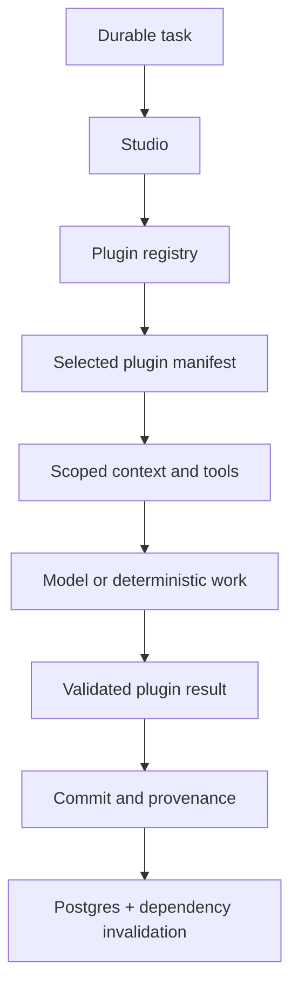
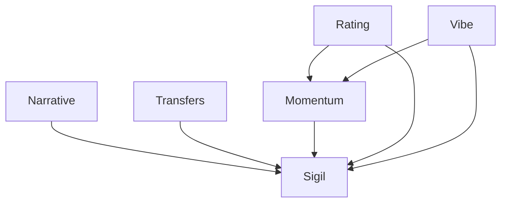

# The Studio provides the room. Plugins bring the cognition.

## Scoracle Studio Plugin Architecture Plan

**Status:** Proposed implementation plan  
**Date:** 2026-09-21  
**Primary scope:** `scoracle-backend/rust`  
**Secondary scope:** the native Swift Articulator runtime and its existing backend slice contract  
**Codebase reviewed:** `scoracle/scoracle-backend` `main` at `e0d0110e571375c618631fb38bff595d1735ff3c`  
**Builds on:** `scoracle_backend_modernization_plan.md`  
**Canonical repo placement when adopted:** `scoracle-wiki/progress_docs/scoracle-backend/2026-09-21_studio-plugin-architecture.md`

---

## 1. The Architectural Sentence

> **The Studio provides the contained space for cognition. Plugins define the cognition that happens inside it.**

The existing Scoracle doctrine remains intact:

> **Postgres stores the evolving world.**  
> **DuckDB studies the world.**  
> **The Studio contains the cognition that evolves it.**  
> **Plugins bring the exact materials required for each cognitive act.**

The Studio should know how to execute cognition safely and efficiently.

It should not know how The Scout scouts, how The Influencer reads the room, how The Investigator researches an unknown entity, or how the on-device Articulator conducts a conversation.

Those identities belong to plugins.

---

## 2. The Decision

Refactor the current Rust Cognition Harness into a small, explicit **Studio runtime**, then package every cognitive seat as a **first-party plugin**.

The Studio owns universal mechanics:

- task lifecycle
- plugin registration and selection
- context-plan execution
- capability and tool containment
- model routing and invocation
- resource budgets and concurrency
- validation sequencing
- transactional commit coordination
- durable work disposition
- dependency invalidation
- provenance, tracing, and failure handling

A plugin owns its cognitive identity:

- stable identity and version
- task kinds it can perform
- context requirements
- context providers or provider registrations
- permitted tools
- model role and inference options
- instructions and prompt construction
- parser and output contract
- domain validation
- product writer
- products consumed and produced
- memory policy
- downstream dependency declarations
- fixture and contract tests

The boundary is:

```text
plugin declares and supplies its kit
              ↓
Studio resolves and contains execution
              ↓
plugin performs its bounded cognitive work
              ↓
Studio validates lifecycle, commits, records, and releases
```

### One hard rule

The character itself must not assemble its own world.

A plugin may package the providers that know how to obtain its materials, but the Studio executes those providers through scoped capabilities before cognition begins. The character receives a prepared, typed context. It does not receive the global database, the global tool registry, or unrestricted network access.

This preserves the original harness insight while making the character genuinely self-contained.

---

## 3. What “Plugin” Means Here

For Scoracle, a plugin is an architectural unit, not a dynamically loaded shared library.

### Use

- statically linked Rust plugins registered at boot
- statically linked Swift plugins registered inside the app
- compile-time types for context and output
- explicit manifests for runtime policy
- native implementations in each product language

### Do not introduce

- runtime `.so` / `.dylib` loading
- a plugin marketplace
- filesystem discovery
- scripting as the main extension mechanism
- a shared Rust-to-Swift framework
- serialization between Studio and plugin merely to simulate process isolation

The extensibility win comes from a stable contract and a domain-blind core, not from runtime binary loading.

The shared asset across Rust and Swift is the **Studio contract and vocabulary**, not shared implementation code.

---

## 4. Why This Is an Evolution, Not a Rewrite

The current backend already contains most of the correct pieces.

| Current asset | What it already provides | Target role |
|---|---|---|
| `rust/src/harness.rs` | model extraction, typed parsing, generation provenance, debounce helpers | split into Studio inference/generation services and compatibility helpers |
| `rust/src/stage.rs` | object-safe `StageHandler` plug-in seam | compatibility adapter, then replaced by the Studio plugin contract |
| `rust/src/worker.rs` | durable draining, supervision, timeouts, concurrency, shutdown | retained as the Studio's durable task runner |
| `rust/src/work.rs` | queue state, leases, retry/backoff, deferral, stage ordering | retained as the Postgres work adapter; renamed only late, if useful |
| `rust/src/route.rs` | `Role` → backend/model routing and host governors | retained behind the Studio inference broker |
| `rust/src/ledger.rs` | durable generation provenance | retained and expanded into Studio execution provenance |
| `rust/src/fetch.rs` | budgeted HTTP retrieval, domain spacing, cache, circuit breaking | split into generic web capability plus Editor-specific article extraction |
| `rust/src/junctions/*` | character prompts, inputs, parsing, execution, persistence, tests | becomes the plugin fleet |
| `rust/src/junctions/form.rs` | shared card form | reusable character-plugin support, not Studio core |
| `rust/src/guards.rs` | shared output integrity guards | reusable character-plugin support, not Studio core |
| `go/internal/articulator` | byte-stable Articulator DATA composition | remains the server-side Articulator context provider |

The current `StageHandler` is already a proto-plugin:

```rust
#[async_trait]
pub trait StageHandler: Send + Sync {
    fn stage(&self) -> Stage;
    async fn handle(&self, hx: &Harness, item: &Item) -> Result<()>;
    fn rotation_batch(&self) -> i64;
    fn max_in_flight(&self) -> usize;
    fn slot_group(&self) -> Option<(&'static str, usize)>;
}
```

It proves the registration and polymorphism model.

Its current weakness is that `handle` owns almost the entire lifecycle. Character handlers directly load from `hx.pool`, call models, persist rows, write ledgers, and enqueue downstream work. That makes the handler self-contained in implementation, but not contained by the harness.

The refactor should preserve the proven mechanics while making each responsibility explicit.

---

## 5. Target Architecture



The execution path becomes:

```text
task claimed
    ↓
plugin selected
    ↓
manifest checked
    ↓
declared context providers executed
    ↓
typed minimal context assembled
    ↓
declared tools exposed
    ↓
model role resolved / deterministic work run
    ↓
plugin parses and validates
    ↓
Studio opens commit boundary
    ↓
plugin product writer persists
    ↓
Studio records provenance and invalidates dependents
    ↓
work completes, defers, retries, or fails closed
```

The Studio does not contain a `match` arm for Journalist, Scout, Influencer, Insider, Analyst, Oracle, Investigator, or Articulator behavior.

Adding a plugin should require registration, not editing the Studio's execution logic.

---

## 6. Responsibility Boundaries

| Layer | Owns | Must not own |
|---|---|---|
| Studio core | lifecycle, registry, provider execution, tool gating, inference transport, budgets, commit boundary, work disposition, dependency engine, telemetry | sports meaning, character voice, product-specific SQL, prompt content |
| Plugin package | manifest, context recipe, domain providers, model role, prompt, parser, validation, product writer, dependency declarations, fixtures | queue leases, global routing, raw unrestricted capabilities, global retries |
| Postgres adapter | durable world reads/writes, work queue, product storage, transactions | character meaning or model behavior |
| DuckDB adapter | historical and statistical analytical reads | canonical application state or product persistence |
| Tool adapters | HTTP/browser/search/app capabilities with policy and telemetry | deciding which plugin may use them |
| Model adapters | Ollama/OpenAI-compatible/MLX invocation | character prompts or product rules |

### The important distinction

The plugin **owns the definition** of its materials.

The Studio **owns the act of supplying them**.

For example, the Vibe plugin packages a `VibeContext` recipe and the providers for live packets, previous Vibe, relational memory, and identity. The Studio executes those providers with scoped read access, assembles the context, and gives that context to The Influencer.

The Influencer never receives `PgPool`.

---

## 7. The Two-Level Plugin Contract

Scoracle has both simple one-call characters and compound workflows. The contract should support both without forcing everything into the most complicated shape.

### Level 1: `StudioPlugin`

This is the object-safe runtime seam held by the registry.

```rust
#[async_trait]
pub trait StudioPlugin: Send + Sync {
    fn manifest(&self) -> &'static PluginManifest;

    async fn execute(
        &self,
        run: PluginRun<'_>,
    ) -> anyhow::Result<PluginOutcome>;
}
```

`PluginRun` is scoped to one plugin and one task. It exposes only what the manifest permits.

```rust
pub struct PluginRun<'a> {
    pub task: &'a Task,
    pub context: ResolvedContext,
    pub providers: ScopedProviders<'a>,
    pub inference: ScopedInference<'a>,
    pub tools: ScopedTools<'a>,
    pub clock: &'a dyn Clock,
}
```

`context` contains the material declared up front. `providers` exists for compound workflows whose declared context keys are discovered during execution, such as The Insider iterating transfer pairs. It can resolve only provider IDs granted by the manifest and remains subject to the Studio's call and time budgets.

The registry stores `Arc<dyn StudioPlugin>`.

Compound workflows can implement this contract directly:

- The Insider's multi-pair vetting and final wire wrap
- The Editor's acquisition, read, link, and packet workflow
- The Investigator's search/fetch/adjudication loop
- deterministic acquisition work such as fixture box scores

### Level 2: `CognitivePlugin`

This is a typed convenience contract for the common character shape.

```rust
pub trait CognitivePlugin: Send + Sync + 'static {
    type Context: Send;
    type Output: Send;

    fn manifest(&self) -> &'static PluginManifest;
    fn context_plan(&self, task: &Task) -> ContextPlan<Self::Context>;
    fn inference_request(&self, context: &Self::Context) -> InferenceRequest;
    fn parse(&self, response: ModelResponse) -> Result<Parsed<Self::Output>>;
    fn validate(&self, output: Parsed<Self::Output>, context: &Self::Context)
        -> Result<Validated<Self::Output>>;
    fn commit_plan(
        &self,
        task: &Task,
        context: &Self::Context,
        output: Validated<Self::Output>,
    ) -> CommitPlan;
}
```

A generic `CognitiveAdapter<P>` implements `StudioPlugin` for any `CognitivePlugin` and runs the universal sequence.

`Parsed<T>` must preserve the current fail-closed distinction between a valid value, an explicit no-data/unknown marker, and a transport or programming error. The refactor must not collapse today's `Result<Option<T>>` discipline into a fabricated default value.

This preserves typed contexts and outputs without requiring the object-safe registry to erase domain types manually.

### Why two levels are justified

One rigid “one prompt in, one row out” trait would fit The Analyst and The Oracle but distort The Insider, Editor, and Investigator.

One completely open-ended `execute` trait would fit everything but fail to remove lifecycle duplication from the six character plugins.

The base contract plus a typed adapter keeps the core small and the common path disciplined.

---

## 8. Plugin Manifest

Every plugin exposes a static manifest. The manifest is descriptive policy; it should not contain executable business logic.

```rust
pub struct PluginManifest {
    pub id: PluginId,
    pub contract_version: &'static str,
    pub tasks: &'static [TaskKind],
    pub entity_kinds: &'static [EntityKind],
    pub model_roles: &'static [Role],
    pub context_requirements: &'static [ProviderId],
    pub tools: &'static [ToolGrant],
    pub consumes: &'static [ProductKind],
    pub produces: &'static [ProductKind],
    pub resources: ResourceProfile,
    pub failure_policy: FailurePolicy,
}
```

### Manifest rules

- `id` is stable and semantic, such as `scoracle.character.vibe`.
- `contract_version` changes when context, prompt, parser, validation, or product meaning changes.
- `model_roles` names routing roles, never concrete model hosts.
- `context_requirements` are opt-in; an empty list means the plugin starts with nothing.
- `tools` are deny-by-default grants.
- `consumes` and `produces` drive dependency invalidation only after that engine is enabled.
- `resources` replaces stage-specific scheduling logic currently scattered across handlers.
- a plugin package may expose more than one task kind when one cognitive identity performs a compound job.

The registry validates at boot:

- unique plugin IDs
- unique task ownership unless an explicit router exists
- all provider IDs resolve
- every requested tool exists
- model roles resolve
- resource groups are valid
- product dependency cycles are rejected
- enabled plugins have their required configuration

Boot should fail clearly rather than run a partially wired cognitive fleet.

---

## 9. Context: The Plugin Brings the Recipe, the Studio Builds the World

### Context plan

A context plan is an explicit list of provider calls plus the typed assembly function.

Conceptually:

```rust
fn context_plan(&self, task: &Task) -> ContextPlan<MomentumContext> {
    ContextPlan::new()
        .require(entity_identity(task.subject()))
        .require(latest_rating_card(task.subject()))
        .require(latest_vibe_card(task.subject()))
        .require(momentum_snapshot(task.subject()))
        .assemble(MomentumContext::from_parts)
}
```

Provider implementations may be packaged with the plugin, but they run through Studio-owned adapters:

- `WorldRead` for Postgres operational truth
- `AnalyticsRead` for DuckDB study
- `ProductRead` for prior cards and memory
- `WebResearch` for permitted research sources
- `ConversationRead` for local Articulator state

### Enforcement

After migration, a character plugin should not hold:

- `PgPool`
- `DuckDBConnection`
- a raw HTTP client
- the global `Router`
- the global tool registry

It receives:

- its task
- its prepared typed context
- a scoped inference handle
- only its declared model-callable tools

### Provider location

Domain-specific providers belong with their plugin or in a deliberately shared Scoracle provider package.

Generic adapters belong to the Studio.

Example:

```text
plugins/rating/providers.rs
    knows which world and analytics facts Rating needs

studio/adapters/postgres.rs
    knows how to execute safe Postgres reads

studio/adapters/duckdb.rs
    knows how to execute analytical reads
```

This keeps the Studio domain-blind without forcing the character to wander through storage.

---

## 10. Tools and Capability Containment

Tools should be granted per plugin and per task.

### Tool classes

1. **Preparation capabilities**  
   Used by context providers before inference: database reads, analytics queries, HTTP acquisition, cached document retrieval.

2. **Model-callable tools**  
   Exposed inside an agentic inference loop when the model genuinely needs to choose an action: browser search, page open, follow-up lookup, or an app action.

3. **Commit capabilities**  
   Used only after validation: product writes, memory writes, queue effects, notifications.

The manifest must distinguish these classes. A preparation capability does not automatically become visible to the model.

### Tool broker responsibilities

- deny undeclared tools
- enforce domain allowlists
- enforce call, token, time, and byte budgets
- preserve current per-domain spacing and circuit breaking
- record every call and result status
- redact secrets from model-visible output and logs
- make cancellation and deadline behavior consistent
- return typed errors

### Current code migration

- keep `BudgetedFetcher` behavior
- move generic fetch policy, cache, domain locks, and circuit breaking behind a Studio web capability
- keep article extraction and boilerplate cleanup with the Editor plugin
- keep Wikimedia interpretation with the Investigator plugin
- keep box-score source selection and parsing with the fixture-boxscore plugin
- grant ordinary character plugins no external network tools

The Investigator can then bring its research kit without turning browser search into a global Studio feature.

---

## 11. Inference Boundary

The current `Router` and `Inference` trait are strong seams and should remain.

The plugin declares:

- one or more `Role` values
- prompt/system instructions
- temperature
- context/output budgets
- schema mode
- repair allowance, if any

The Studio inference broker resolves:

- concrete backend
- concrete model
- host concurrency governor
- deadline and cancellation
- request/response telemetry

The plugin never names `OllamaClient`, `OpenAiClient`, a URL, or a GPU host.

### Repair policy

Default policy:

```text
one inference
    ↓
parse + validate
    ↓
optional one bounded repair only when the plugin explicitly declares it
    ↓
fail closed or retry through durable work
```

Do not introduce hidden model retries inside adapters. Queue backoff remains the outer reliability mechanism.

---

## 12. Validation and Commit Boundary

Validation remains plugin-owned because validity is product-specific.

The Studio owns when validation occurs and when persistence is allowed.

```text
raw response
    ↓
plugin parse
    ↓
plugin domain validation
    ↓
validated output
    ↓
Studio commit boundary
    ↓
plugin product writer
    ↓
ledger + dependency effects
```

No product write should occur before the final validated value exists, except explicitly modeled progress writes in a compound workflow.

A plugin product writer receives a transaction-scoped commit capability, not a raw global pool. Product-specific SQL remains with the plugin while transaction ownership remains with the Studio.

### Plugin outcome

The runtime needs an explicit result instead of plugins directly manipulating queue state.

```rust
pub enum PluginOutcome {
    Committed(CommitEffects),
    Noop { reason: &'static str },
    Marker(CommitEffects),
    Deferred {
        after: Duration,
        note: String,
        made_progress: bool,
    },
}
```

An error remains retryable unless classified otherwise by policy.

The Studio maps outcomes onto the current `pipeline_work` operations.

This removes direct `work::defer`, `work::enqueue`, and completion decisions from plugins. It also lets the Studio enforce the existing rule that deferral is legal only after durable progress.

---

## 13. Products, Dependencies, and Invalidation

The system is not a linear pipeline. Plugins consume and produce versioned products.



The manifest should eventually express this as product dependencies:

| Plugin | Consumes | Produces |
|---|---|---|
| Narrative / Journalist | editor packets, narrative memory, identity | narrative card(s) |
| Rating / Scout | statistical profile, trajectory, personnel, availability, identity | rating card |
| Vibe / Influencer | live packets, emotional continuity, identity | vibe card |
| Transfers / Insider | transfer candidates, pair evidence, source reliability, memory | transfer calls + wire card |
| Momentum / Analyst | rating trajectory, vibe trajectory, deterministic snapshot | momentum card |
| Sigil / Oracle | the five finished cards | sigil card |

### Migration discipline

Do not replace current explicit enqueues first.

Order:

1. record dependencies in manifests without changing behavior
2. compare manifest-derived invalidations with current enqueues in shadow mode
3. enable Studio invalidation for one edge
4. prove no duplicate, lost, or stale work
5. migrate the remaining edges
6. delete direct downstream enqueues from plugins

The queue still stores durable work. The semantic change is that the Studio derives newly stale work from product relationships instead of a character manually naming the next stage.

---

## 14. Plugin Fleet

### Reader-facing character plugins

| Plugin ID | Character | Current module | Context kit | Model role | Product |
|---|---|---|---|---|---|
| `scoracle.character.narrative` | The Journalist | `junctions/journalist` | identity, packet corpus, framing, narrative memory, prior card reads | `NarrativeLogic` | `news_summaries` |
| `scoracle.character.rating` | The Scout | `junctions/scout` | identity, rating profile, form trajectory, z-memory, personnel, confirmed/reported availability | `StatsLogic` | `stat_summaries` |
| `scoracle.character.vibe` | The Influencer | `junctions/influencer` | identity, live packets, previous scored Vibe, relational memory | `VibeLogic` | `vibe_scores` |
| `scoracle.character.transfers` | The Insider | `junctions/insider` | candidates, pair evidence, relationships, source reliability, prior wire reads | `TransferLogic` plus adjudication roles already used by the module | `transfer_rumors` + wire card |
| `scoracle.character.momentum` | The Analyst | `junctions/analyst` | identity, rating trajectory, vibe trajectory, deterministic momentum snapshot | `MomentumLogic` | `momentum_summaries` |
| `scoracle.character.sigil` | The Oracle | `junctions/oracle` | identity and the five finished cards only | `OracleLogic` | `sigil_synthesis` |

### Internal Rust plugins

These are not reader-facing characters, but they must also leave the Studio core or the core will still know Scoracle-specific work.

| Plugin ID | Current module | Purpose | Capabilities |
|---|---|---|---|
| `scoracle.internal.editor` | `junctions/editor` | read articles, derive evidence, packets, routing | article fetch, optional browser fallback, Postgres read/write, Editor model role |
| `scoracle.internal.graph` | `junctions/graph` | extract typed relations and persons | prepared article context, model inference, graph product writes |
| `scoracle.internal.investigator` | `junctions/investigator/entity.rs` | resolve and enrich unknown entities | Wikimedia/search/fetch, source policy, Investigator role, fact writes |
| `scoracle.internal.fixture_boxscore` | `junctions/investigator/boxscore.rs` | retrieve and normalize box scores | budgeted HTTP fetch, deterministic parsing, fact writes; no model required |

`FixtureBoxscore` is useful proof that a Studio plugin is a bounded work module, not necessarily an LLM character.

### Swift plugin

| Plugin ID | Runtime | Context kit | Model | Product |
|---|---|---|---|---|
| `scoracle.client.articulator` | native Swift Studio | exact backend `p1`–`p8` DATA slice, follow-up slice, conversation state, explicitly granted app tools | on-device fused/quantized Articulator through MLX | validated chat turn + optional app effects |

---

## 15. Recommended Rust Layout

Final target:

```text
rust/src/
├── studio/
│   ├── mod.rs                 # Studio composition root
│   ├── plugin.rs              # StudioPlugin, CognitivePlugin, adapters
│   ├── manifest.rs            # manifest and boot validation
│   ├── registry.rs            # task → plugin resolution
│   ├── task.rs                # task identity independent of queue storage
│   ├── context.rs             # context plans and provider executor
│   ├── capabilities.rs        # scoped grants
│   ├── tools.rs               # tool broker
│   ├── inference.rs           # Router-facing inference broker
│   ├── commit.rs              # transaction and outcome coordination
│   ├── dependency.rs          # product invalidation graph
│   ├── telemetry.rs           # cognition ledger correlation
│   └── worker.rs              # current durable worker, evolved
├── plugins/
│   ├── support/
│   │   ├── card_form.rs       # current junctions/form.rs
│   │   ├── guards.rs
│   │   └── trajectory.rs
│   ├── journalist/
│   ├── scout/
│   ├── influencer/
│   ├── insider/
│   ├── analyst/
│   ├── oracle/
│   ├── editor/
│   ├── graph/
│   └── investigator/
├── adapters/
│   ├── postgres.rs
│   ├── duckdb.rs
│   └── web.rs
└── ...
```

### Do not perform this directory move first

Create the contract and prove one plugin while current modules remain in `junctions/`.

The `junctions` → `plugins` move should be a late mechanical change after every module implements the new contract. Architectural movement and file movement should not be debugged simultaneously.

### Keep files proportional

Do not split every plugin into eight ceremonial files.

A simple plugin may remain:

```text
analyst/
├── mod.rs
├── context.rs
├── prompt.rs
└── tests.rs
```

A complex plugin such as Insider or Editor can keep additional focused modules. The contract matters more than symmetric folders.

---

## 16. The Swift Studio and Articulator Plugin

The Swift implementation should share the Rust Studio's architecture, not its code.

### Swift Studio owns

- plugin registration
- task/session lifecycle
- cancellation and time budgets
- local model adapter selection
- scoped app-tool exposure
- context-provider execution
- output validation sequencing
- local telemetry
- conversation-state coordination

### Articulator plugin owns

- Articulator identity and instructions
- intent → `p1`–`p8` context requirement mapping
- follow-up policy
- exact prompt construction around `DATA:`
- on-device model role/configuration
- chat-output parsing and validation
- permitted app tools
- memory/conversation policy

### Preserve the existing backend boundary

The backend already provides the correct context-provider contract:

```text
GET /api/v1/{sport}/team/{id}/articulator/{kind}
```

The response contains the exact compact JSON **string** used by the trained model. The phone must continue to pass that string through without parsing and reserializing it.

The plugin architecture must preserve:

- server-side composition in `go/internal/articulator`
- byte-stable train/inference parity
- `p1`–`p8` task shapes
- `p6` follow-up data
- quiet-card behavior
- the existing 1,632-comparison parity gate for 204 teams × 8 kinds

The Swift Articulator plugin brings the policy for selecting and using a slice. It does not take ownership of composing the slice.

### Native protocol sketch

```swift
protocol StudioPlugin {
    associatedtype Context
    associatedtype Output

    var manifest: PluginManifest { get }
    func contextPlan(for task: StudioTask) -> ContextPlan<Context>
    func perform(context: Context, session: StudioSession) async throws -> Output
    func validate(_ output: Output, context: Context) throws -> Validated<Output>
}
```

The Swift Studio can be much smaller than the Rust Studio because it does not need a durable Postgres work queue. The contract remains recognizable while the implementation stays native to the app.

---

## 17. Migration Plan

## Phase 0 — Freeze the Current Contracts

### Goal

Create a behavior baseline before changing architecture.

### Work

- record the current plugin roster from `main.rs`
- record `VOICE_ORDER`, slot groups, per-stage caps, retries, deadlines, and queue semantics
- run the existing Rust unit and fixture gates
- capture representative production-shaped inputs and outputs for each live character
- preserve current prompt versions and input hashes
- record current downstream enqueue edges
- treat the Articulator slice parity suite as immutable during this refactor

### Exit criteria

- every current stage has a named baseline
- migration can detect behavior, persistence, ordering, or provenance drift
- no product contract changes are bundled into the architecture work

---

## Phase 1 — Introduce the Studio Shell Without Behavior Change

### Goal

Make “Studio” a real top-level runtime while executing every existing handler exactly as today.

### Add

```text
rust/src/studio/mod.rs
rust/src/studio/plugin.rs
rust/src/studio/manifest.rs
rust/src/studio/registry.rs
rust/src/studio/task.rs
```

### Implement

- `PluginId`
- `PluginManifest`
- `StudioPlugin`
- `PluginRegistry`
- `LegacyStagePlugin<H: StageHandler>`
- boot-time uniqueness/configuration checks

`LegacyStagePlugin` delegates to the existing `StageHandler::handle`. It is deliberately transitional.

### Change

- `main.rs` builds a registry instead of a hand-written `match` that pushes handlers
- `Worker` asks the registry for runnable plugins
- existing `COGNITION_STAGES` behavior remains supported
- current registration order, `VOICE_ORDER`, slot groups, and caps remain identical

### Do not change

- SQL
- prompts
- parsers
- product writes
- enqueue behavior
- model routes
- queue schema

### Exit criteria

- production behavior is byte-for-byte / row-for-row equivalent where deterministic
- all current stages run through the Studio registry
- no character-specific branch exists in the Studio executor
- disabling/enabling current work still behaves as before

---

## Phase 2 — Build the Typed Cognitive Adapter and Migrate The Analyst

### Why The Analyst first

The Analyst is the cleanest proof:

- bounded context
- one model role
- one generated product
- explicit deterministic direction and conviction
- small current handler
- clear upstream products: Rating and Vibe
- clear downstream product: Sigil

### Work

- add `ContextPlan<T>` and provider execution
- add `ScopedInference`
- add `CognitivePlugin` and `CognitiveAdapter<P>`
- add `PluginOutcome`
- implement `MomentumPlugin`
- move Analyst context acquisition behind declared providers
- keep existing prompt, parser, validation, product row, ledger payload, hashes, and enqueue behavior

### Target Analyst kit

```text
MomentumPlugin
├── manifest
├── MomentumContext recipe
│   ├── entity identity
│   ├── latest Rating card/trajectory
│   ├── latest Vibe card/trajectory
│   └── deterministic momentum snapshot
├── MomentumLogic route
├── prompt + parser
├── title/entity guard
├── momentum_summaries writer
└── fixtures
```

### Exit criteria

- Analyst cognition receives a typed context and no raw `PgPool`
- the Studio runs its context, inference, validation, and commit lifecycle
- existing momentum fixtures and production contract pass unchanged
- the legacy Analyst handler is deleted

---

## Phase 3 — Migrate the Producer Pair: Vibe and Rating

### Goal

Prove the plugin system across both major rails feeding Momentum.

### Vibe

- required: identity, live packets
- optional enrichment: prior scored Vibe, relational memory
- preserve marker behavior and buried-scored-row logic
- preserve input-hash debounce
- preserve the rule that packet fan-out is the sole Vibe waker

### Rating

Split the context recipe into two provider families:

```text
World providers
├── identity
├── roster/personnel changes
├── confirmed availability
└── reported availability

Analytics providers
├── rating profile
├── z-score profile/history
├── recent form trajectory
└── peer/cohort comparisons
```

Initially, analytics providers may adapt the current Postgres implementation. The interface is the important first move. DuckDB can replace those providers after parity without changing The Scout.

Preserve transfer/availability trigger bypass behavior and current input-version semantics.

### Exit criteria

- Vibe and Rating have no raw database or global-router access in their cognitive path
- their outputs invalidate Momentum through the same behavior as today
- current fixture, debounce, marker, and provenance behavior remains intact
- the future DuckDB seam exists only where analytical study belongs

---

## Phase 4 — Migrate Narrative, Transfers, and Sigil

### Narrative

- package packet corpus, framing, narrative memory, prior card reads, and identity as its context recipe
- preserve corpus budgets and grounding
- preserve `news_summaries` marker semantics
- do not let shared card form leak into Studio core

### Transfers

Treat Insider as one plugin package with a compound workflow.

Do not force the current multi-pair team drain into the one-call `CognitivePlugin` adapter.

The plugin may implement `StudioPlugin` directly while using Studio services for:

- pair context preparation
- model calls
- deadlines
- progress reporting
- persistence transactions
- deferred disposition

Preserve:

- pair-level debounce
- fail-closed UNKNOWN behavior
- source reliability
- applied identity logic
- team-level time budget
- progress-guaranteed deferral
- final wire scoring

Once stable, consider separate internal task kinds for pair adjudication and wire wrap. That is optional; do not make it a prerequisite for the plugin boundary.

### Sigil

- migrate after all five producers
- consume finished cards only
- preserve deterministic convergence and omen computation before inference
- preserve no-pillar markers
- preserve input-hash debounce
- keep the Oracle blind to raw articles, raw box scores, databases, and memories

### Exit criteria

- all six reader-facing characters are registered plugins
- the Studio contains no character prompt, parser, schema, or product SQL
- each character's current role boundary remains intact

---

## Phase 5 — Introduce the Tool Broker and Migrate Internal Work

### Goal

Prove that plugins can bring specialized capabilities without making those capabilities global.

### Order

1. fixture box score — deterministic and tool-bound, no model
2. Investigator — research/fetch plus adjudication
3. Graph — prepared context plus extraction
4. Editor — the broadest internal workflow

### Work

- wrap `BudgetedFetcher` as a scoped web capability
- add tool grants and policy enforcement
- correlate fetch/tool ledger entries with the Studio run ID
- separate generic HTTP mechanics from Editor article extraction
- keep Investigator source interpretation in the Investigator plugin
- keep provider/domain policies outside Studio core

### Exit criteria

- undeclared tool access is impossible
- character plugins have no network grant
- Investigator can bring research capabilities without changing Studio code
- Editor and Investigator retain current rate limits, cache, circuit breaking, and provenance

---

## Phase 6 — Move Dependency Invalidation Into the Studio

### Goal

Remove the remaining pipeline-era character graph from handlers and Postgres orchestration.

### Work

- enable manifest-derived dependency comparison in shadow mode
- log expected downstream invalidations without enqueuing them
- compare with current direct `work::enqueue` calls and SQL triggers
- enable one edge at a time:
  1. Rating → Momentum
  2. Vibe → Momentum
  3. all five changed pillars → Sigil through the settle barrier
- preserve the five-pillar settle barrier
- remove direct plugin enqueues only after parity

### Exit criteria

- plugins report changed products; they do not name downstream stages
- the Studio owns the cognitive dependency graph
- Postgres stores durable outstanding work without understanding character meaning
- no stale or duplicate product churn appears under real workloads

---

## Phase 7 — Move Rating Study Behind DuckDB Providers

### Goal

Connect this refactor to the existing three-pillar modernization plan.

### Work

- implement DuckDB-backed `AnalyticsRead` providers for the Rating context
- shadow current Postgres analytical outputs
- compare profiles, rolling windows, trajectories, percentiles, and cohorts
- route one bounded analytical component through DuckDB
- expand only after parity and product-quality review
- retire superseded Postgres analytics only after production proof

### Exit criteria

- The Scout does not know whether analytical context came from Postgres or DuckDB
- Postgres remains canonical
- DuckDB can be rebuilt from canonical data
- analytical movement does not change the plugin contract

---

## Phase 8 — Build the Native Swift Studio Around Articulator

### Goal

Give the iOS app the same architectural primitive without sharing Rust implementation.

### Work

- create the Swift `Studio`, registry, manifest, context-plan, and scoped-tool protocols
- register `ArticulatorPlugin`
- wrap the current MLX model behind a local inference adapter
- wrap the existing Articulator endpoint as `ArticulatorSliceProvider`
- preserve the raw `data` string exactly
- make intent/slice selection and follow-up behavior plugin-owned
- move any Articulator-specific app tools behind declared grants
- retain conversation state outside the model

### Exit criteria

- the Swift Studio knows how to run a plugin but knows nothing about sports-chat behavior
- Articulator owns its cognitive and tool policy
- the existing backend parity gate still passes
- the phone does not reimplement server slice composition

---

## Phase 9 — Final Naming and Demolition

### Work

- move `junctions/` to `plugins/`
- absorb or rename the old `Harness` type once all callers use `Studio`
- remove `LegacyStagePlugin`
- remove obsolete `StageHandler`
- remove direct downstream enqueue helpers
- remove raw pool access from character modules
- remove dead compatibility adapters
- decide whether `COGNITION_STAGES` should gain a `STUDIO_PLUGINS` alias
- decide whether `pipeline_work` deserves a late rename; do not require it
- update README, architecture docs, glossary, runbook, and diagrams
- record the architectural landmark in the shared wiki changelog

### Exit criteria

- code names match the architecture
- there is one obvious Studio composition root
- there is one obvious plugin registry
- every cognitive or enrichment task is visibly owned by a plugin
- transitional paths are gone

---

## 18. Verification Strategy

### Layer 1 — Contract tests

- manifest IDs and task ownership are unique
- required providers and tools resolve
- denied capabilities stay denied
- product dependency graph is acyclic
- resource groups and concurrency limits match current deployment

### Layer 2 — Plugin unit tests

- context assembly from provider fixtures
- prompt construction
- parsing
- domain validation
- marker/no-data behavior
- commit-plan generation

### Layer 3 — Existing seat fixtures

Retain the current fixture suites as the primary character-quality gate:

- Narrative
- Rating
- Vibe
- Transfers
- Momentum
- Oracle
- Editor
- Investigator
- Graph

Architecture work must not be used to quietly retune a character.

### Layer 4 — Shadow parity

Where practical, run legacy and plugin paths from the same frozen context and compare:

- built prompt
- request body
- parsed output
- validation result
- product payload
- input hash
- ledger envelope
- downstream invalidation proposal

Do not double-write product rows. Shadow runs remain read-only until explicitly promoted.

### Layer 5 — Durable lifecycle tests

- crash after claim
- timeout during provider execution
- timeout during inference
- validation failure
- failure during commit
- partial-progress deferral
- shutdown with unprocessed claims
- dead-letter behavior

### Layer 6 — Articulator parity

The existing byte-for-byte slice comparison remains non-optional. The plugin refactor does not relax train/inference identity.

---

## 19. Provenance and Observability

Extend the current `cognition_ledger`; do not replace it.

Every Studio run should be traceable through:

```text
run_id
task identity + input version
plugin id + contract version
provider ids + provider versions
included/excluded context
tool calls + policy outcomes
model role + concrete model
prompt version + request body
parser and validator outcome
product row ids
dependency invalidations
timings and budgets
final work disposition
```

The most important new field is `plugin_id`. It becomes the stable identity connecting configuration, context, tools, inference, products, and evaluation.

Provider and tool failures should remain distinguishable from model failures. A browser timeout, a missing context row, a parser refusal, and a product-write failure are not the same operational event.

---

## 20. Guardrails

### Do not let the Studio become the application

If a core module imports a character prompt, a sports product schema, a transfer stage, a Vibe rule, or an Articulator slice kind, the boundary is leaking.

### Do not let plugins become mini-harnesses

If a character plugin owns queue retries, global concurrency, unrestricted storage, global routing, or ad hoc downstream scheduling, the boundary is leaking in the other direction.

### Do not create one universal context object

Context remains opt-in and task-shaped.

### Do not expose every tool to every model

Tools are deny-by-default and plugin-scoped.

### Do not encode model hosts in plugins

Plugins declare roles. The Studio routes them.

### Do not mix architecture migration with voice tuning

Prompt behavior changes require their own measured work.

### Do not force compound workflows into a one-call abstraction

Use the base `StudioPlugin` contract where the typed convenience adapter does not fit.

### Do not rename durable infrastructure early

Semantic correctness matters more than replacing every occurrence of “pipeline” in the first pass.

---

## 21. Definition of Done

The refactor is complete when all of the following are true.

### Studio

- has one obvious composition root
- selects work through a validated registry
- owns lifecycle, resources, tools, inference transport, commit coordination, invalidation, and provenance
- contains no Scoracle character behavior
- can run a deterministic non-model plugin
- can run a compound multi-call plugin

### Plugins

- each seat owns its context recipe, instructions, model role, tools, parser, validator, writer, memory policy, dependencies, and fixtures
- character cognition receives prepared context, not raw global infrastructure
- no plugin can use an undeclared tool
- no character plugin directly controls queue lifecycle
- no character plugin directly names downstream work

### Data

- Postgres remains canonical and durable
- DuckDB remains analytical and replaceable
- plugin context does not reveal which storage engine supplied a value
- state and memory remain outside the model

### Runtime

- current queue durability, backoff, stale recovery, supervision, shutdown, and GPU governance survive
- fixture quality does not regress
- product contracts and marker semantics remain intact
- provenance becomes more complete, not less

### Swift

- Articulator is a plugin in a native Swift Studio
- the plugin owns chat cognition and tool policy
- backend DATA composition remains byte-stable and server-owned
- Rust and Swift share architecture vocabulary, not implementation code

### Extensibility test

A future Scoracle character can be added by creating and registering a plugin package.

The Studio core does not change.

---

## 22. The First Implementation Slice

The first slice should be deliberately small and behavior-neutral:

> **Add the Studio registry, `PluginManifest`, `StudioPlugin`, and `LegacyStagePlugin`, then register the existing handlers through it without changing one prompt, SQL query, model route, product write, or enqueue.**

Suggested first change set:

```text
add    rust/src/studio/mod.rs
add    rust/src/studio/plugin.rs
add    rust/src/studio/manifest.rs
add    rust/src/studio/registry.rs
add    rust/src/studio/task.rs
edit   rust/src/lib.rs
edit   rust/src/main.rs
edit   rust/src/worker.rs
test   registry uniqueness + current roster/order/resource parity
```

That establishes the contained room.

The next change migrates The Analyst into the first true plugin.

---

## 23. Final Mental Model

```text
Postgres stores the evolving world.

DuckDB studies the world.

The Studio provides a contained execution space.

Plugins arrive with the context recipe, tools, model role, rules, and product contract required for one kind of cognition.

The model creates inside that space.

The Studio validates the lifecycle, preserves the result, and becomes quiet again.
```

The Studio is the room.

The plugin is the artist's kit.

The model is the artist.

The task is the commission.
