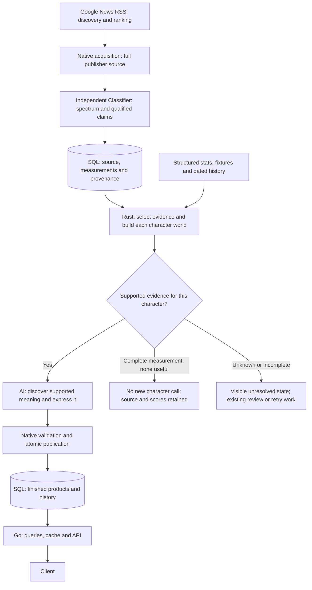
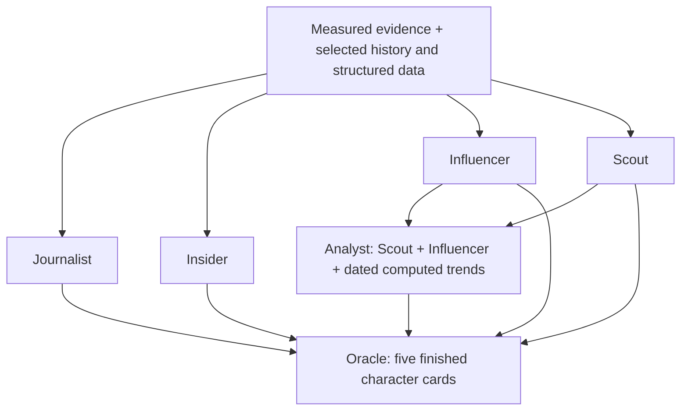

# Scoracle Classifier Plugin

## Launch concept: measure a spectrum, then let characters express it

**Status:** Qualified claim-packet compiler tested across 14 sources and three articulators; 192 model calls retained, no model promoted. Automatic qualification, gold labels, additional heads and production cutover remain — October 7, 2026

**Placement:** After Google News RSS discovery and native full-source acquisition

**First goal:** Replace separate intake relevance gates with a reusable spectrum of attributed evidence

**Model strategy:** Accuracy first; choose classifier and qualification resources from measured quality, then evaluate cost and throughput

**Governing target:** [Target design — October 7, 2026](#target-design--october-7-2026). Relevance is derived from the complete spectrum of supported downstream evidence. No useful signal means no new character work; unknown or failed measurement is never absence. This target supersedes earlier model-size and separate-gate assumptions.

---

## Execution ledger

The tracked plan is this file; the original was supplied from Downloads. The user's launch instruction authorizes replacing Harvester and Editor directly on `main`; protecting the broken production flow with a prolonged parallel rollout is not a requirement. Model quality, source integrity, uncertainty, coverage, and reproducibility still need evidence.

- [x] Preserve current development and consolidate it onto `main`, pushed through `7f49d5a2`. Correct five stale regression checks; 384 active Rust tests pass (65 database/model checks remain ignored without their dependencies).
- [x] Trace current intake: Go RSS provenance → Harvester headline gate → Editor acquisition/windowed Laya scores → source-bound classifications and character assignments. Existing source receipts, canonical IDs, worker claims, and transactional publication are reusable. Current routing is uncalibrated and the source/model experiments did not establish factual fidelity.
- [x] Phase 1: source-bound 40-item replay of three compact emotion encoders; matched four-model comparison on 20 opening windows plus eight synthetic controls. Full vectors, exact input windows, checkpoint identities, timings and limitations retained.
- [x] Exclude Laya from the launch bank at the user's instruction; preserve its historical comparison receipts. The live Harvester/Editor runtime is unchanged until Classifier cutover.
- [x] Map all six character plugins' actual material contracts; define 51 independent presence dimensions, three ordinal annotations and exact-span claim qualifiers. Prepare and validate a source-only 40-item review pilot with all annotations unknown.
- [x] Document the governing deconstruct → retain → build → discover/express → serve architecture, spectrum-derived relevance, per-character no-action decisions and explicit unknown/failure states. Remove superseded fixed-size and separate-admission design assumptions.
- [x] Export and prepare 400 retained sources (314 publishers, 3,699 complete source windows) for Phase 2 review.
- [ ] Phase 2: independently reviewed 300–500 item gold set, with source-group/time splits and ambiguous/unknown labels.
- [ ] Train and compare the additional heads on Horizon/SamLowe backbones; retain the existing emotion checkpoints as baselines. Evaluate each signal family before choosing a deployment checkpoint.
- [ ] Phase 3: held-out quality/calibration, real-corpus CPU/GPU throughput, and evidence/attribution checks.
- [ ] Validate the spectrum-derived gate against reviewed downstream usefulness; distinguish per-character abstention from item-wide no action and preserve failures/unknowns and retained evidence.
- [ ] Replace the two intake stages with one Classifier stage; retain versioned measurements separately from routing and source evidence. Run source/publication checks and a direct production cutover when the selected slice works.
- [x] Complete an independent 60-call Classifier-to-expression diagnostic with source-bound emotion vectors; compare source-only and spectrum inputs on eight controls plus two retained reports across three articulators. Preserve failed replies and AI provisional semantic review; no model promoted.
- [x] Bind claim relationships and qualifications to exact source spans; select emotional evidence independently of Harvester and keep full score/source receipts.
- [x] Test source-only, raw-spectrum and qualified packets on 12 fictional controls plus two retained reports; inspect fidelity and distinguish model replies from native abstentions. Preserve 192 calls, 60 native abstentions and four failed replies across four stages; fix lost correction/identity context.
- [ ] Complete fidelity review and real-source evaluation before promoting an articulation model or replacing production intake.

First implementation decision: reuse the existing retained-source export and Python/PyTorch model tooling for the Phase 1 bench. No classifier framework, generated summaries, invented calibration mapping, or automatic emotional interpretation from score maxima.

October 7 progress: exported 40 canonical retained articles (35 publishers; FOOTBALL, NFL and NBA) through a read-only production transaction. The source-only sample includes injuries, transactions, recaps, opinions, non-English reporting, galleries, statistics and quiet/low-relevance items; it is not a gold or representative accuracy set. Added eight synthetic attribution, negation, mixed-emotion, time, unrelated-entity and sarcasm controls. The three emotion encoders receive all 374 real-source windows plus the controls. The matched Laya comparison uses the exact first production window of 20 articles plus the same controls; excerpt scope, original body hashes and byte ranges are explicit, and excerpt coverage is not called full-article coverage.

The user requested a Laya comparison. The installed English Laya checkpoint (`55cf4c4ebb4ebe31b2550e8bdf3bd21b99753851`) is included with 28 independent emotion predicates and continuous scores. Current gatekeeper cutoffs are excluded from this bench. It is compared with Horizon small, ModernBERT-GoEmotions and the SamLowe RoBERTa reference; the latter is MIT and is an evaluation reference, not a deployment selection.

The initial token-overflow replay explicitly failed complete-source checks on 32–33 items per encoder. Its failed receipts are retained in the isolated run directory. The comparison initially reused `harvester::cognition::prepare_text`. Windowing now lives in `tools::source::windows`; Classifier imports the source tool directly, validates its exact UTF-8 spans and tokenizes each shared window without truncation. Coverage failures remain errors, never zero scores. Archbox's GTX 1070 Ti exists, but its installed PyTorch CUDA build excludes `sm_61`; the first comparison uses CPU with two threads and records that GPU limitation.

Code and raw run directory: `examples/classifier_{export.sql,windows.rs,replay.py}` and `/mnt/data/backup/scoracle/classifier-launch/2026-10-07/` on Archbox. `examples/test_classifier_replay.py` verifies original Unicode byte ranges, refuses omission of a late qualification and checks trained label identities, target scope and review evidence. The archived probe retains the corrected neutral question descriptions. Completed results and the evaluation decision follow below.

Bounded-comparison decision: the initial complete-article Laya run took 57,409 ms and 89,464 ms for its first two articles with 28 independent emotion questions. It was stopped with completed receipts preserved, rather than extrapolating a production throughput claim or requiring an hours-long experiment before inspecting any quality. This checkpoint contains 421,293,830 stored weight elements, so it is not the proposed 149M specialist. CPU, two threads, precision, question wording and model revisions are retained; GPU execution fails a measured kernel probe with the installed CUDA build. The user specifically requested comparison rather than a predetermined encoder or LLM choice.

Phase 1 completed: [measured comparison and recommendation](classifier-spectrum-comparison-2026-10-07.md). Verified 144 full-source encoder receipts and 112 matched receipts: complete declared input, 28 finite scores, no truncation or errors. Matched median CPU latency per real opening window was 159 ms Horizon, 254 ms SamLowe, 321 ms ModernBERT-GoEmotions and 24,827 ms for the English Laya 28-question bank. These are measurements of this configuration, not daily-corpus throughput or model accuracy. The three specialists took 60.22, 97.82 and 136.37 seconds respectively for the 40 complete retained sources.

Laya can measure continuous predicates and ordinal intensity without text generation. Its baseline emotion questions nevertheless scored explicitly denied joy/relief highly. A separate five-question probe improved relief negation when scoped to Alex, but current-time and target relevance remained unreliable. The initial neutral question had conflicting answer descriptions; those receipts are preserved, its scores excluded from quality conclusions, and a corrected neutral probe was run separately. The documented two-option `choice` workaround was also tested: it still attributed current optimism to an old quote and failed to separate unrelated-team reporting reliably. SDK confidence and calibration claims do not establish Scoracle calibration.

Initial comparison decision, subsequently superseded for Laya: retain Laya as a measured candidate, not the sole gatekeeper by default. The user has now excluded Laya from the launch bank. Carry Horizon small and SamLowe forward as fast emotion baselines; compare target relevance/topic separately on reviewed sources. None of these article/window emotion vectors identifies the speaker, time or supporting phrase by itself. In particular, past hope and another team's joy are legitimate text-level signals but cannot establish current target mood. Source byte ranges bind the input; they are not model explanations.

Next work is the independently reviewed gold set and held-out relevance/attribution checks, followed by the smallest useful Classifier slice and direct cutover on `main`. No production Classifier stage has been deployed in Phase 1. The 8,000–9,000-item replay, GPU execution, sports calibration, downstream factual/emotional support and removal of Harvester/Editor remain open. The retained source sample also contains publisher navigation/paywall/gallery furniture, so source acquisition quality must be reviewed alongside model quality.

## Downstream vector contract — October 7 update

The user wants the gate to distill raw reporting into scored, attributed evidence before vetting articulation models. One Classifier plugin can supply a bank of measurements. The benchmark selected fast **emotion baselines**, not an accuracy winner for all downstream tasks. New labels require supervised training and held-out validation; changing a checkpoint's label names or adding randomly initialized output weights does not create a capable injury, transfer or relevance model. Standard [Transformers classification fine-tuning](https://huggingface.co/docs/transformers/main/en/tasks/sequence_classification) supplies the existing model-loading/training machinery; no new classifier framework is needed.

The executable contract is [vector-schema-v1.json](../fixtures/classifier/vector-schema-v1.json):

| Family | Dimensions and scope | Preparation / model role |
|---|---|---|
| Emotion | 28 independent GoEmotions dimensions per exact document window | Existing Horizon/SamLowe heads; expression in a text remains distinct from current target emotion. |
| Relevance | Direct subject, opponent context, incidental mention, per supplied target/window | New target-conditioned head. Query provenance supplies a candidate identity, never a positive label. |
| Topic | Match event, performance, availability, player move, contract, staffing, discipline, off-field, routine, league context, per target/window | New multi-label head; an injury topic or transfer topic does not establish an actual injury or move. |
| Discourse | Reported assertion, attributed quote, opinion, speculation, prediction, explicit denial, correction, per document window | New multi-label head; preserve competing forms in the same report. |
| Temporal framing | Current, historical and future references, per document window | New head plus explicit event-time qualifiers; report dates never substitute for event dates. |
| Ordinal measurements | Target valence 0–100, intensity 0–3, negotiation stage 0–3 | Reviewed annotations and later task-specific heads; no invented conversion from emotion maxima. Unknown remains null. A stage score describes reporting, not a completed move. |
| Claim qualifiers | Speaker, subject, counterparty, reported event time, negation, uncertainty, source disagreement | Exact supporting source spans and reviewed identity/claim relationships; a window classifier alone does not extract these. Span selection/extraction still requires its own validation. |

Each downstream world must preserve the source excerpts, evidence scope, model/head/version, raw score, calibration status and explicit unknowns alongside any selected signal. It must not replace source claims with a generated summary or collapse everything into one confidence number. Document-level signals, attributed claims and trusted structured records remain distinguishable in the package.

| Character / real implementation | Required world | Where it comes from |
|---|---|---|
| Journalist — `plugins/journalist/prompt.rs`, `memories.rs` | Fresh events/results, targets, attributed reporting, denial/correction/uncertainty, report dates and specifically attached history | Classifier relevance/topic/discourse/time measurements plus exact source claims; existing source-backed continuity. |
| Insider — `plugins/insider/prompt.rs`, `mod.rs` | Moves/contracts/staffing, counterparty, reported versus denied claim, negotiation stage, source disagreement, dated history and publisher outcome record | Classified evidence and exact quotes plus existing resolved identity links and tracked/confirmed publisher samples. A move score never mutates a roster. |
| Influencer — `plugins/influencer/prompt.rs` | Named speaker/target emotion, supported mixtures, valence, intensity, timing and change during a reporting period | Emotion vectors plus attributed spans and explicit time, followed by validated period aggregation. Unknown is neither neutral nor valence 50; one speaker is not the fanbase. |
| Scout — `plugins/scout/prompt.rs`, `sources.rs`, `performance.rs` | Performance measurements and their percentile/cohort/sample limits; availability/personnel changes; relevant attributed news | Keep existing deterministic/statistical measurements and adjudicated records; add scored reporting slices. Do not classify a percentile, fitness outcome or completed transfer into existence. |
| Analyst — `plugins/analyst/prompt.rs`, `tools/memories.rs` | Finished Scout/Influencer readings, dated score histories, window/sample sizes and computed trajectories | Existing products and deterministic history calculations. No separate RSS momentum label is required. |
| Oracle — `plugins/oracle/prompt.rs` | The five finished character cards, agreement/conflict, missing products and shared provenance | Existing downstream synthesis inputs. Do not treat repeated cards sharing one article as independent confirmation. |

Implementation completed in this update:

- The replay accepts one or more trained vector families sharing a document or target input scope; verifies exact checkpoint label identities; retains every independent score; and binds target identity framing plus unchanged source windows to the measured input. Existing emotion inference remains unchanged. An emotion checkpoint fails clearly if asked for topic/discourse labels. Local trained safetensors checkpoints can be replayed with declared revision and weight hashes. Ordinal-head inference/training is not implemented yet.
- Laya inference and SDK question helpers were removed from the active bench. The exact original and corrected-neutral scripts remain in the private Archbox experiment directory as `classifier_replay.original.py` and `classifier_replay.neutral-v2.py`, along with the original requests/responses.
- [classifier_review.py](../examples/classifier_review.py) prepares blind review packets and validates edits against a separate retained-source input. Labels start as null, positives and ordinal annotations require exact model-visible evidence, and every evidence span retains the claim qualifier fields. Reviewers must mark source extraction usability separately. A named reviewer is recorded, but the validator cannot prove reviewer independence or annotation correctness.
- The 40 existing sources produced 374 document windows and 976 review units (374 document, 602 target). All 22,038 presence annotations and 1,806 ordinal annotations remain unknown. These are prepared review materials, **not gold labels**. All 40 sources were already measured in Phase 1 and are barred from a fresh held-out test split. Syndication groups must be assigned before splitting, and the validator rejects groups shared across splits; time-based separation still requires review.
- Pilot materials are local and private: `/private/tmp/scoracle-classifier-launch-20261007/review-v1/windowed-source.jsonl`, `review-with-ordinal.jsonl`, and `manifest-with-ordinal.json`. The directory is mode 0700. The raw publisher text was not added to Git.
- The initial 400-source export approval block was resolved by the user’s explicit authorization to export and continue. The existing read-only `examples/classifier_export.sql` completed with `sample_size=400`; full text and metadata remain in the private Archbox review directory and its local counterpart. No publisher text was added to Git.

Verification at this phase: two runnable contract checks covered complete Unicode source bounds, no omitted late qualification, exact supporting evidence, named review, incompatible head labels and document/target scope separation. Sixteen real-model receipts on the eight fictional controls reproduced the prior Horizon/SamLowe token IDs and emotion vectors with **maximum score delta 0**. This verifies the replay refactor, not new-head accuracy. The larger gold set, additional trained heads, evidence extraction, calibration, full-load replay, production replacement and held-out articulation-model evaluation remain open.

Validate the current review packet:

```sh
python3 examples/classifier_review.py \
  /private/tmp/scoracle-classifier-launch-20261007/review-v1/source-400.jsonl \
  /private/tmp/scoracle-classifier-launch-20261007/review-v1/review-400-provisional-v2.jsonl --validate
python3 -m unittest discover -s examples -p test_classifier_replay.py
```

The next execution step is to review and split independent source groups, train the smallest additional heads on the candidate backbones, compare per-family quality/calibration and verify exact claim support. Select the usable gate after that evaluation. A bounded expression pilot can proceed now on existing emotion measurements, with every untrained signal explicitly unknown; it is not gate acceptance. Keep the original emotion checkpoints intact while training/comparing the new tasks; share encoder execution or consolidate heads only when the measured implementation warrants it.

## Pruning and Phase 2 preparation — October 7 continuation

The user's governing instruction is to retain only complexity that serves the durable Classifier product. Current use alone is not a retention reason. The direct `main` cutover remains the goal; these offline preparation tools are not a deployed Classifier.

- Removed seven obsolete Harvester/Fastino experiment files, including two historical test files: 745 lines of binary annotation, trace-manifest, headline/routing scoring and unused alternative-server tooling. No runtime launcher or Rust caller used them. Their exact source and dated evidence remain recoverable from commit `5c956402`; the old reports now identify the commands as retired. Classifier review code imports no legacy review format.
- Moved the existing complete source-window algorithm into `tools::source::windows`. Classifier no longer imports Harvester cognition, its first-three-paragraph delivery shape or its 64-window policy. The offline Classifier budget defaults to 256 windows and remains explicit; exceeding it fails complete coverage. Existing intake consumes the same source tool until replacement, without a duplicate algorithm or a new compatibility layer.
- The 400-source export contains 314 publishers and 773 resolved query-target identities across FOOTBALL/NFL/NBA. It covers 2,082,928 source bytes in 3,699 windows; the longest source requires 116 windows. The original 64-window attempt failed and its partial output is retained separately. The successful neutral-tool export exactly reproduces the earlier complete export's text and UTF-8 ranges, while dropping the old selection metadata.
- Prepared 11,662 review units: 3,699 document windows and 7,963 target windows. Forty sources were already measured in Phase 1; the additional 360 have not had their model scores inspected or used for selection. This is a stratified retained-source sample, not a representative gold set. Syndication groups and time splits remain unassigned.
- Added a bounded AI-assisted seed: 25 presence suggestions across 12 units, with exact supporting spans and explicit claim qualifiers. These remain `ai_provisional`, unassigned and barred from training/evaluation. All 23,889 ordinal annotations and 244,056 remaining presence annotations are unknown. Initial inspection flags obfuscated publisher text, ad-block interstitials, galleries and recommended-story feeds separately from relevance.
- Added [classifier_train.py](../examples/classifier_train.py): one native Transformers/PyTorch multi-label head on a frozen candidate encoder, exact requested label identities, unchanged target framing and source text, unknown-label masking, positive/negative coverage reporting and hash-bound checkpoint provenance. It resets the new task's linear head weights, preserves the original emotion checkpoints and adds no dependencies. It refuses empty training data, unreviewed extraction and missing positive/negative training coverage. `--check` confirms **zero eligible training/dev/test units** in the current real-source packets. Independent review remains necessary before real-source fitting; no new task accuracy or calibration is claimed.

The source-free [preparation manifest](../fixtures/classifier/review-preparation-2026-10-07.json) records counts, limits and exact file hashes. Private Archbox files are under `/mnt/data/backup/scoracle/classifier-launch/2026-10-07/review-v1/`; the local copies are under `/private/tmp/scoracle-classifier-launch-20261007/review-v1/`. `review-400-v2.jsonl` is the blind packet and `review-400-provisional-v2.jsonl` contains the clearly marked AI suggestions. Old pilot packets remain historical receipts, not an active compatibility format.

Verification: the Rust library passes **368 tests, 64 ignored**, including four source-tool checks and six existing intake cognition checks. Complete byte-for-byte span equivalence across all 400 sources and validation of all 400 review packets also pass. Three Python contract checks pass in Archbox's installed model runtime, including zero gradient for an unknown label; local Python skips that one check because torch is absent. The [native training/replay check](../fixtures/classifier/training-contract-check-2026-10-07.json) fits and reloads both candidate heads on eight entirely fictional controls with explicitly artificial labels: 16 successful receipts, all 13 requested presence dimensions finite, no truncation, and unchanged encoder tensors (134 Horizon; 197 SamLowe). That mechanical check does not establish sports accuracy. Actual fitting of the provisional real-source packet fails before loading a model or creating a checkpoint. The two artificial test checkpoints were then pruned (1.10 GB); inputs, settings, hashes and replay receipts remain. Ordinal heads, calibrated routing, evidence extraction and production replacement remain open.

Check readiness before fitting the target-conditioned head:

```sh
python3 examples/classifier_train.py SOURCE.jsonl REVIEW.jsonl NEW_CHECKPOINT \
  --model Horizon-Labs/multilingual-emotions-small@1bc9627f189e5aa08b00cf525c3c86052067b81e \
  --vector-family relevance --vector-family topic --check
```

Next: independently verify the AI seed and extraction flags, label the missing positive/negative cases, assign source groups and a later held-out time cohort, fit/compare the two candidate backbones, then replace the old intake path with the smallest validated Classifier slice. The plan's original prolonged shadow phase is superseded by the user's direct-cutover authorization.

## Classifier-to-expression pilot — October 7

The user confirmed that Classifier must replace Harvester as a separate plugin. The offline Classifier and articulation replay import no Harvester or Editor code, invoke no Laya protocol and use no old routing thresholds. The retained-source SQL export reads historical RSS query provenance to construct the review sample; those query identities are candidate targets, not positive relevance labels. Live stage registration, acquisition/publication ownership and delivery queries still need the actual cutover; no deployed replacement is claimed.

Moved `SourceContext` from Harvester delivery into the existing shared `tools::source` module and updated all character consumers. There is no compatibility re-export under Harvester. The current delivery reader consumes the neutral type until replacement. This move preserves serialization and existing receipts; it does not make Classifier depend on Harvester's reader.

The new [offline articulation replay](../examples/classifier_articulation.py) binds complete source text to the existing Horizon emotion receipts, validates all 28 dimensions, preserves the exact raw vectors and model revision, and leaves relevance/topic/discourse/qualifiers/ordinals unknown. The world contains original reporting, not a generated summary. The expression task can reason across the supplied clues but must preserve speaker, target, time, denial and uncertainty. It does not invent a target valence score while that head is absent.

The pilot holds ten cases constant: eight fictional controls plus two previously exported publisher reports (Melton availability and Daniels absence). Each model receives both source-only input and the same input with the full spectrum. Expected review notes are retained outside generation input. The trials use temperature 0, seed 42, context 4,096, output budget 400, thinking disabled, the same prose schema and a single model call; no repair stage or database publication occurs.

Candidates: current `alibayram/smollm3:latest` versus `smollm2:1.7b` and `qwen3:1.7b`. The latter two were downloaded into the existing local runtime for this pilot. SmolLM2 is actually 1,711,376,384 stored parameters, Q8_0. The Qwen 1.7B tag reports 2,031,739,904 stored parameters, Q4_K_M, so the runtime size is recorded explicitly rather than assuming its tag is a precise count. The current SmolLM3 is reported as 3.1B, Q4_K_M. Precision, load and active-host contention differ; latency is configuration-specific. The primary [SmolLM2 model card](https://huggingface.co/HuggingFaceTB/SmolLM2-1.7B-Instruct) describes rewriting/summarization support, and the [Qwen card](https://huggingface.co/Qwen/Qwen3-1.7B) describes its modes. Neither establishes Scoracle fidelity.

Completed: **60 calls**, with 20/20 structurally valid replies from SmolLM3, 18/20 from SmolLM2 and 20/20 from Qwen. SmolLM2's two failed spectrum replies reached the 400-token output limit and remain retained. AI source inspection flagged attribution, time, unsupported-emotion, abstention and prose-completeness failures across all three models. No articulator is promoted; full vectors alone did not establish usable expression. The [diagnostic report](classifier-articulation-pilot-2026-10-07.md) and [source-free receipts](../fixtures/classifier/articulation-pilot-2026-10-07.json) record the findings and limitations. Independent review and held-out real-source acceptance remain open.

The Rust library still passes 368 tests, with 64 environment-dependent checks ignored. All four Python contract checks pass in the existing Archbox runtime; local Python skips the torch-dependent one. The new check covers unchanged source binding, full-vector retention, explicit unknowns and consistent abstention. Exact requests, replies, models/digests and timing receipts are retained privately under Archbox `/mnt/data/backup/scoracle/classifier-launch/2026-10-07/articulation-v1/` and its local counterpart. Structural success is recorded separately from semantic fidelity. The cognition worker was briefly paused to resolve model-loading contention and restored afterward; cognition, API and Laya services all reported active, with production model routes unchanged.

Next expression test: select supported measured signals and exact attributed claims into a compact world after relevance/time/qualification validation, then compare the same candidates again. Smaller models remain plausible, but this pilot does not demonstrate that either can replace the baseline safely. Live Classifier registration and delivery cutover are still pending; Classifier will replace the old plugins, not delegate to them.

The user's research handoff also identifies Pleias-RAG-1B (described as 1.2B) and Pleias-RAG-350M as future source-synthesis candidates, with custom query/source tokens and 4,096-token training context. Their primary cards/paper and limitations are linked in the diagnostic report. Neither was installed, tested or selected here. The handoff reports current plugin contexts of 4,096; future evidence bundles must reserve room for instructions, reasoning and output within that total.

## Qualified claim-packet retest — October 7 continuation

The next requirement is an expression world with speaker, subject, target relationship, time and qualification attached to each exact source claim. Implemented source-bound claim validation in the existing review tool and a qualified variant in the existing articulation replay. It rejects changed source hashes/quotes, unanchored target links, missing denial/time/correction evidence, duplicate claim spans and unresolved emotional target relationships. Literal span validation cannot prove that an annotated relationship is semantically correct.

The qualified audit world contains selected exact claims and literal qualifier text, source identity/hash, review provenance and selected emotion dimensions from their original document windows. Full source, all 28 scores and full qualification spans remain in hash-bound receipts. These window scores are not target probabilities or intensity; additional trained heads and target ordinals remain absent. Information-only, unrelated, conditional-feeling, statement-denial and withdrawn claims remain in the review ledger but do not supply an observed emotional claim. When a complete reviewed source has no eligible emotional claim, the offline replay abstains without a model call; an unresolved target relation fails for review rather than becoming an all-zero vector. This is character-specific evidence selection, not deletion of reporting from the Classifier world.

This isolates packet usefulness with **provisional AI source annotations**, not automatic claim-extraction accuracy or independent gold. The 400-source training/evaluation eligibility is unchanged. Four new fictional controls cover conditional future feeling, denial of a statement, correction and a current feeling about a future event. The 14-case retest holds the three candidates and generation settings constant and compares source-only, raw spectrum and qualified claims under the same updated instructions. Failed replies are retained; no repair or publication stage is added.

Completed: **252 comparison slots = 192 model calls + 60 native abstentions** across the initial three-input comparison and three focused follow-ups. Four malformed replies remain retained. Model inputs now omit numeric scores, review bookkeeping and unknown bookkeeping fields while preserving those details in the audit world. The compiler retains complete supporting paragraphs so corrections and identity links keep their antecedents. The final run has 27 structurally valid model replies and 15 native abstentions, with fidelity errors still present; no model is promoted. The [qualified-world report](classifier-qualified-world-test-2026-10-07.md) and [source-free receipts](../fixtures/classifier/qualified-world-test-2026-10-07.json) record the findings and provisional source inspection.

All five Python checks pass in Archbox's installed runtime; local Python skips the torch-dependent check. Four focused Rust source-tool tests pass, and all 400 existing review packets validate. Every recorded input plus its reserved output budget stayed below 4,096 (maximum 3,736); full paragraph context needs native token-budget checks before production integration. The cognition worker's exit handler restored it after each run, and cognition/API/Laya services all reported active. No production model route changed.

Private run directory: `/mnt/data/backup/scoracle/classifier-launch/2026-10-07/qualification-v1/` on Archbox, with a local counterpart under `/private/tmp/scoracle-classifier-launch-20261007/qualification-v1/`. `reader-v2`, `reader-v3` and `context-v4` retain the follow-ups without overwriting earlier failures. Next: independently review extraction/relationships, fit/compare missing heads and validate automatic span/relationship extraction; then evaluate held-out real-source expression and integrate the independent Classifier stage.

## Target design — October 7, 2026

This is the governing target for the Classifier launch. It incorporates the user's clarified design and supersedes the earlier assumption that classification should be a cheap preliminary gate, a fixed model-size target, and the separate Harvester/Editor admission path. The execution ledger above records what is actually implemented; this section records what the finished product must do.

### Deconstruct, retain, build, discover and express

Classification is valuable intelligence work. The Classifier deconstructs publisher reporting into a spectrum of source-backed signals and relationships. SQL retains that measured world. Rust builds the evidence payload for each character. Character AI discovers what the supplied evidence supports and expresses a useful reading. SQL and Go retain and serve the finished products.

The same reporting can support several different jobs. An availability update can matter to Scout without expressing emotion. A denied transfer can matter to Insider and Journalist even though no transfer happened. A report can contain both hope and worry, expressed by different people at different times. Accurate deconstruction lets every character work from those distinctions instead of reconstructing them independently from a pile of articles.

The central design decision is:

> **Relevance is derived from the spectrum of evidence needed downstream. A complete, usable measurement with no supported signal for any character produces no new character work.**

The binary decision to do work is a projection of that richer record. There is no separate AI yes/no relevance test before the Classifier and no delegation to Harvester or Editor. Target relevance is still measured inside the spectrum: direct subject, opponent context and incidental mention distinguish whose reporting a signal belongs to.

### End-to-end ownership



| Stage | Responsibility | Intelligence and cost boundary |
|---|---|---|
| Google News / Go RSS intake | Discover and rank candidate reporting; retain query, rank, URL, publisher and candidate identity. | Reuse Google's discovery signal without a model call in intake. A search match is a candidate, not proof of target relevance. Native network and ingest work still exists. |
| Native acquisition | Resolve publisher URLs, fetch or reuse full text, normalize and deduplicate, retain canonical IDs and exact source bytes. | Ordinary code owns collection. Failed extraction and publisher furniture remain quality issues, not negative relevance. |
| Classifier AI | Measure independent signals and identify source-supported claims and their relationships, qualifications and time. | Spend intelligence where semantic understanding is necessary. An encoder, LLM or measured combination may serve this job. |
| SQL and native analytics | Store source and derived records separately; query history, count, aggregate and calculate bounded factual measurements. | Reuse evidence and arithmetic. A stored AI interpretation remains an interpretation; SQL does not turn it into a verified fact. |
| Rust character plugins | Select each character's scope, useful signals, exact supporting source, compatible history, statistics, limits and instructions. | Deterministic preparation builds a coherent world without prewriting the model's conclusion. |
| Character AI | Reason across that world, discover supported relationships or patterns, and express the character's reading. | This is the second semantic stage. The model reads prepared evidence; it does not retrieve more material or invent missing facts. |
| SQL + Go serving | Retain accepted products, query them, cache and serve them to clients. | Client reads reuse saved work. Normal product requests do not repeat classification or character inference. |

“Cheap” and “expensive” describe where the architecture concentrates work, not measured prices or fixed resource promises. Acquisition, storage and analytics have costs too. Classification quality comes first; runtime cost and throughput are measured on the real workload.

### Spectrum-derived relevance

“Nothing registers” means **no supported, actionable evidence under the evaluated policy for the processed target and downstream character scope**. It does not mean every raw score equals zero. Independent sigmoid heads generally produce nonzero numbers, and different dimensions need different evaluated interpretations. A high generic emotion score can describe someone other than the target or an old quotation. A low emotion score can accompany important factual reporting.

Rust applies explicit, versioned selection rules over the measured spectrum and qualified source evidence. These rules check the target relationship, signal meaning, source support, time, qualification and the character's actual job. They produce scheduling decisions without asking another model to repeat a binary relevance judgment. Keep the dimensions and decisions inspectable; do not collapse them into one global confidence number.

Two scopes matter:

- **Character scope:** no eligible emotional evidence can mean no Influencer call while the same source still serves Scout or Journalist. Each character chooses its own slice.
- **Item/target scope:** no new character work is warranted only when every applicable consumer has a complete, usable measurement for its required signals and none has eligible evidence. This conclusion applies to the processed scope; it does not declare the article irrelevant to every other entity or future use.

| Measured situation | Required disposition |
|---|---|
| Supported signal with the necessary target, time and qualification | Make it available to the relevant character. Coalesce with its other evidence and avoid duplicate calls when the prepared world has not changed. |
| Complete usable measurement; no eligible signal for this character | Record the disposition and omit that character call. Preserve the source, vectors and other characters' eligibility. |
| Complete usable measurement; no eligible signal for any applicable consumer in scope | No new character work. Keep the retained record available for history, aggregation, audit and future remeasurement. |
| Untrained family, uncertain relationship, insufficient support or missing time required by the task | Keep the affected value or disposition unknown/unresolved. Do not turn it into zero, neutral or a completed “nothing useful” decision. |
| Fetch failure, unusable extraction, unsupported labels, changed source, missing windows, truncation or inference failure | Record the failure and use existing durable work/retry mechanics where appropriate. Never publish an all-zero replacement result. |

There is no need to manufacture a character card to say nothing happened. There is also no need to call an articulator merely to confirm the compiler's completed no-evidence decision. An unresolved input can prevent a call without becoming evidence of absence.

Weak signals can still contribute to a later reporting-period study even when they do not trigger an immediate character call. No action means no new generation now, not deletion from the measured world. Mixed evidence, denials and corrections are meaningful signals; their polarity must survive selection.

### Examples that define the gate

These are design controls, not claims about measured model accuracy or numeric scores.

| Source situation | Spectrum and relationships | Downstream consequence |
|---|---|---|
| A target player is unavailable; no emotion is expressed. | Target availability/reporting evidence is present; attributed emotion may be absent. | Scout and possibly Journalist can use it. An emotion-only absence cannot discard the article. |
| A different club's player celebrates while the queried club is an incidental mention. | Emotion is present in the document; subject/target relationships bind it to the other club. | Do not assign that joy to the queried club. Evaluate other resolved targets within the actual processing scope. |
| “Alex denies agreeing to a move.” | Move topic, explicit denial and attributed subject are present. | Insider/Journalist can express the denial; no completed transfer or roster change is inferred. |
| Alex expressed hope in an old interview. | Optimism, attributed speaker and historical event-time evidence are present. | Keep it as dated history where appropriate; it does not establish current target mood. |
| A relief claim is withdrawn and replaced by Alex's current worry. | Correction, withdrawn claim, current worry and their source relationships are distinct. | Preserve the full supporting context and select the current claim; never revive the withdrawn feeling. |
| The complete source contains no evidence useful to any applicable character for the processed target. | Required signal families and relationships were measured successfully; all character selections are empty. | Retain the receipt and skip new character work. |
| Only the emotion head ran, or the publisher returned an interstitial. | Required relevance/topic/relationship evidence or usable source coverage is missing. | Unknown/incomplete, never a successful “nothing registered” result. |

### The reusable measured world

The [vector schema](../fixtures/classifier/vector-schema-v1.json) remains the concrete vocabulary: **51 independent presence dimensions, three target ordinals and seven claim qualifiers**. The dimensions include relevance, topic, emotion, discourse and temporal framing. The qualifiers bind speaker, subject, counterparty, reported event time, negation, uncertainty and source disagreement to exact source spans. A presence vector alone does not extract these relationships.

Every measured record needs enough information to distinguish support, absence, ambiguity and failure:

- Canonical article/source IDs, original retained text and hash, publisher, URL, report date, query provenance and known duplicate references.
- Exact complete input windows and byte ranges; model-visible coverage, token counts and explicit truncation or acquisition failures.
- Model/head/tokenizer and schema versions, input scope, supplied target identity where relevant, original scores and calibration status. Missing or untrained dimensions stay unknown.
- Exact source claims and supporting qualifier/identity spans, including competing or withdrawn statements. Literal matching proves source binding; relationship correctness requires separate evaluation.
- Target- and character-specific selection decisions, their policy versions and reasons. A decision never overwrites the underlying measurement.
- Native statistical inputs, dates, samples, cohorts and calculation provenance kept distinguishable from semantic model outputs.

Document/window measurements may be reused across characters. Target-conditioned measurements remain bound to their particular target. Reuse unchanged source/model/scope results instead of independently reclassifying the article for each character; recompute when the actual source, scope, head or model version changes. Do not pretend one document-wide vector represents every player in it.

Classification records describe reporting and its evidence. Topic presence does not confirm an injury or transfer, model confidence does not measure a person's emotional intensity, and report time does not supply missing event time. Confirmed identity changes and trusted structured records retain their own native acceptance rules.

### Rust prepares; AI discovers and expresses

The character plugin chooses its world from measured evidence, history and trusted structured records. It supplies the selected exact claims, complete supporting source paragraphs, named relationships, relevant dates and qualifications, and meaningful gaps or disagreement. The world carries evidence and constraints without prescribing a headline, sentiment or conclusion.

Keep two views of this work:

- **Audit/selection view:** original scores, scope, hashes, model versions, review status, source bindings, explicit unknowns and policy decisions. SQL and Rust use this record for selection, studies and reproducibility.
- **Expression view:** supported source wording and relationships, relevant history, task instructions, and native statistical measurements needed by that character. Raw text-label probabilities, checkpoint hashes and provisional review bookkeeping are not prose clues. Trusted performance values, percentiles and computed trends can still be legitimate numerical evidence.

Do not replace the original evidence with an intermediate generated summary. Preserve the supporting paragraph when a quotation depends on an antecedent, denial, correction or identity elsewhere in that paragraph. Validate the actual token budget before inference; oversized evidence needs a visible disposition rather than silent clipping or an invented summary.

Character AI has room to discover meaning across the supplied evidence, including supported mixtures, tensions and changes over time. Its job extends beyond paraphrasing, but its claims must remain traceable to that world. Native acceptance checks structure, source integrity, qualifications and product-specific constraints before atomic publication. Structural validity alone does not prove semantic fidelity.

The downstream dependency order remains:



Each character owns its inference and accepted product. Analyst studies finished Scout/Influencer readings and native trajectories. Oracle synthesizes five finished cards and their explicit missingness and provenance. Repeated cards based on one article are not independent confirmation.

### Quality first; choose compute from evidence

The target does not require an LLM, an encoder-only bank, a particular parameter count or a particular inference cost. Classification and relationship extraction need serious semantic accuracy. Choose the smallest measured implementation that meets the job, and use a stronger resource when the evidence shows the smaller one fails. A roughly 149M encoder is a benchmark candidate, not a design ceiling. Smaller articulators are also candidates rather than a promised consequence.

Evaluate signal detection, target/time/qualification accuracy, evidence extraction, calibration, native no-action decisions and downstream expression separately. Fast scoring and successful JSON cannot substitute for those checks. Spend compute on reusable deconstruction and evidence-based discovery; keep collection, arithmetic, persistence, payload assembly and serving in native tools.

Prune anything that does not serve this contract: the standalone headline relevance gate, the Harvester/Editor classification/routing dependency, generated editorial intermediates, obsolete review formats, unsupported score conversions and unused experiment machinery. Retain reusable acquisition/source tools, canonical identities, history, source validation, durable work receipts, claim fencing and atomic publication. Do not keep a legacy fallback through the old plugins in the finished Classifier design.

### What is built and what remains

| Capability | October 7 state |
|---|---|
| Complete source windows and source/checkpoint-bound emotion measurements | Implemented and tested offline. Emotion presence is not independently validated current-target attribution or sports calibration. |
| Qualified claim validation, character evidence selection and supporting-context compiler | Implemented and tested offline using provisional AI annotations. Empty eligible emotional selections can abstain natively. |
| Automatic source claim/relationship extraction | Not implemented or validated as a production capability. Literal span checks do not establish semantic extraction accuracy. |
| Additional presence heads and target ordinals | Schema/review/training preparation exists; real-source fitting, independent gold and held-out validation remain pending. Missing values stay unknown. |
| All-consumer spectrum-derived no-action policy | Target design, not a demonstrated production gate. The current emotion-focused abstention test does not establish item-wide irrelevance. |
| Articulation model selection | Three candidates tested; fidelity errors remain and no model is promoted. |
| Independent production Classifier storage, registration and delivery | Pending. Production still depends on Harvester/Editor. |

### Acceptance and remaining execution

1. **Review the real evidence.** Independently review extraction and claim/target/time/qualification relationships in the prepared 400-source packet. Resolve source groups and time cohorts before fitting or evaluation; provisional annotations remain distinct from gold.
2. **Validate the full required spectrum.** Fit/compare missing families and evaluate automatic claim qualification. Measure per-family false positives/negatives, ambiguity, calibration and complete-source coverage. Unvalidated families cannot supply a successful no-signal judgment.
3. **Test the derived gate.** Measure missed useful reporting and unnecessary character calls against independently reviewed character selections. Include availability without emotion, other-entity emotion, denials, corrections, historical claims, weak accumulated evidence, duplicates and every unknown/failure condition in the table above. Verify that a no-action disposition preserves source and measurements.
4. **Evaluate the actual runtime.** Measure complete-article and target-scoped throughput, peak bursts, CPU/GPU behavior, budgets, reuse and changed-version remeasurement on the real corpus. Do not extrapolate the opening-window benchmark into daily production capacity.
5. **Replace intake directly on main.** Register the independent Classifier, persist its versioned records and change character queries to its own delivery contract. Reuse native mechanics without calling or importing Harvester/Editor. Remove their scheduling, model bindings and obsolete delivery path together when the replacement works. The user does not require a prolonged shadow rollout; failures remain visible through ordinary durable work mechanics.
6. **Accept expression on held-out worlds.** Compare candidate articulators on the same supported inputs, examining factual and emotional support, attribution, time, denial/correction handling, missingness, usefulness, format and token limits. Preserve failed attempts. Keep model choice open until fidelity is demonstrated.

Success is a reusable measured world that makes character work more accurate and avoids inference where there is no supported job to do. It preserves useful gradations and uncertainty while giving each character a clear, evidence-backed scope in which to discover and express meaning.

## Sources

Historical benchmark references checked October 7, 2026. These do not commit the target design to a model or parameter count:

- [Horizon-Labs/multilingual-emotions-small](https://huggingface.co/Horizon-Labs/multilingual-emotions-small) — 141M, Apache 2.0, 28 GoEmotions labels, benchmark table, data and limitations.
- [HR26kk/modernbert-emotion-classifier](https://huggingface.co/HR26kk/modernbert-emotion-classifier) — Apache 2.0, 149M ModernBERT-base, six-label task and reported benchmark.
- [Pradeep-mahato/ModernBERT-GoEmotions](https://huggingface.co/Pradeep-mahato/ModernBERT-GoEmotions) — Apache 2.0, multi-label GoEmotions, independent sigmoid scores and limitations.
- [Hidden-States/roberta-base-goemotions](https://huggingface.co/Hidden-States/roberta-base-goemotions) — Apache 2.0 and model-card metrics for a GoEmotions classifier.
- [SamLowe/roberta-base-go_emotions](https://huggingface.co/SamLowe/roberta-base-go_emotions) — widely used GoEmotions reference checkpoint; license and comparison figures noted in the Horizon card.
- [Horizon-Labs/multilingual-emotions-base](https://huggingface.co/Horizon-Labs/multilingual-emotions-base) — 308M Apache 2.0 comparison model.
- [answerdotai/ModernBERT-base](https://huggingface.co/answerdotai/ModernBERT-base) — 149M base encoder, Apache 2.0, 8,192-token maximum sequence support.
